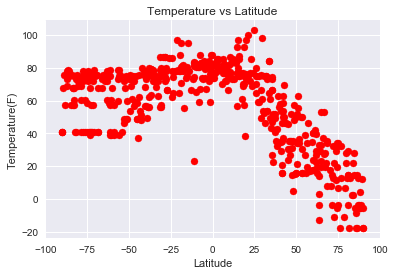
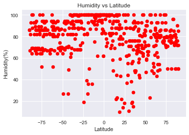
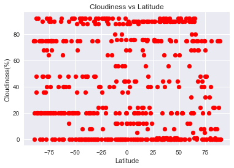
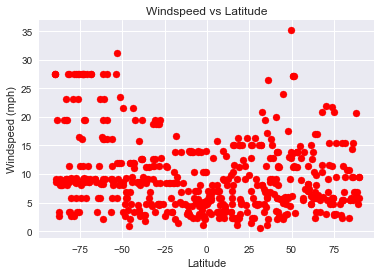

```python
# Dependencies
import json
import requests
from weatherapi import api_key
import openweathermapy.core as owm
import pandas as pd
import random
import seaborn as sns
import numpy as np
from citipy import citipy
import matplotlib.pyplot as plt
```


```python
# Save config information
url = "http://api.openweathermap.org/data/2.5/weather?units=imperial"

# Build query URL
query_url = url + "&appid=" + api_key + "&q="
```


```python
#Random latitudes and longitudes and set up a dataframe
latitude = np.random.uniform(-90,90,600)
longitude = np.random.uniform(-180,180,600)
coordinates = pd.DataFrame({"Latitude": latitude, "Longitude": longitude})
```


```python
#add other columns we want to get from the coordinates
coordinates["City"] = ""
coordinates["Country Code"] = ""
coordinates["Temperature"] = ""
coordinates["Humidity"] = ""
coordinates["Cloudiness"] = ""
coordinates["Wind Speed"] = ""
```


```python
#run through the coordinates to get the cities and countries
for index,row in coordinates.iterrows():
    latitude = row["Latitude"]
    longitude = row["Longitude"]
    city_list = citipy.nearest_city(latitude, longitude)
    coordinates.set_value(index, "City", city_list.city_name)
    coordinates.set_value(index, "Country Code", city_list.country_code)

```

    C:\ProgramData\Anaconda3\lib\site-packages\ipykernel_launcher.py:6: FutureWarning: set_value is deprecated and will be removed in a future release. Please use .at[] or .iat[] accessors instead
      
    C:\ProgramData\Anaconda3\lib\site-packages\ipykernel_launcher.py:7: FutureWarning: set_value is deprecated and will be removed in a future release. Please use .at[] or .iat[] accessors instead
      import sys
    


```python
#run through the cities to get the other weather data
for index, row in coordinates.iterrows():
    city = row["City"]
    country = row["Country Code"]
    location = str(city)+ "," + str(country)
    weather_url = query_url + location
    print(weather_url)
    weatherinfo = requests.get(weather_url).json()
    
    try:
        coordinates.set_value(index, "Temperature", weatherinfo["main"]["temp"])
        coordinates.set_value(index, "Humidity", weatherinfo["main"]["humidity"])
        coordinates.set_value(index, "Cloudiness", weatherinfo["clouds"]["all"])
        coordinates.set_value(index, "Wind Speed", weatherinfo["wind"]["speed"])
    except:
        coordinates.set_value(index, "Temperature", "N/A")
        coordinates.set_value(index, "Humidity", "N/A")
        coordinates.set_value(index, "Cloudiness", "N/A")
        coordinates.set_value(index, "Wind Speed", "N/A")
```

    http://api.openweathermap.org/data/2.5/weather?units=imperial&appid=2dbc1172a9bcb11691ccd61120afdf6d&q=upata,ve
    

    C:\ProgramData\Anaconda3\lib\site-packages\ipykernel_launcher.py:11: FutureWarning: set_value is deprecated and will be removed in a future release. Please use .at[] or .iat[] accessors instead
      # This is added back by InteractiveShellApp.init_path()
    C:\ProgramData\Anaconda3\lib\site-packages\ipykernel_launcher.py:12: FutureWarning: set_value is deprecated and will be removed in a future release. Please use .at[] or .iat[] accessors instead
      if sys.path[0] == '':
    C:\ProgramData\Anaconda3\lib\site-packages\ipykernel_launcher.py:13: FutureWarning: set_value is deprecated and will be removed in a future release. Please use .at[] or .iat[] accessors instead
      del sys.path[0]
    C:\ProgramData\Anaconda3\lib\site-packages\ipykernel_launcher.py:14: FutureWarning: set_value is deprecated and will be removed in a future release. Please use .at[] or .iat[] accessors instead
      
    

    http://api.openweathermap.org/data/2.5/weather?units=imperial&appid=2dbc1172a9bcb11691ccd61120afdf6d&q=saskylakh,ru
    http://api.openweathermap.org/data/2.5/weather?units=imperial&appid=2dbc1172a9bcb11691ccd61120afdf6d&q=kapaa,us
    http://api.openweathermap.org/data/2.5/weather?units=imperial&appid=2dbc1172a9bcb11691ccd61120afdf6d&q=kavieng,pg
    http://api.openweathermap.org/data/2.5/weather?units=imperial&appid=2dbc1172a9bcb11691ccd61120afdf6d&q=tasiilaq,gl
    http://api.openweathermap.org/data/2.5/weather?units=imperial&appid=2dbc1172a9bcb11691ccd61120afdf6d&q=port alfred,za
    http://api.openweathermap.org/data/2.5/weather?units=imperial&appid=2dbc1172a9bcb11691ccd61120afdf6d&q=vaini,to
    http://api.openweathermap.org/data/2.5/weather?units=imperial&appid=2dbc1172a9bcb11691ccd61120afdf6d&q=tasiilaq,gl
    http://api.openweathermap.org/data/2.5/weather?units=imperial&appid=2dbc1172a9bcb11691ccd61120afdf6d&q=puerto ayora,ec
    http://api.openweathermap.org/data/2.5/weather?units=imperial&appid=2dbc1172a9bcb11691ccd61120afdf6d&q=airai,pw
    

    C:\ProgramData\Anaconda3\lib\site-packages\ipykernel_launcher.py:16: FutureWarning: set_value is deprecated and will be removed in a future release. Please use .at[] or .iat[] accessors instead
      app.launch_new_instance()
    C:\ProgramData\Anaconda3\lib\site-packages\ipykernel_launcher.py:17: FutureWarning: set_value is deprecated and will be removed in a future release. Please use .at[] or .iat[] accessors instead
    C:\ProgramData\Anaconda3\lib\site-packages\ipykernel_launcher.py:18: FutureWarning: set_value is deprecated and will be removed in a future release. Please use .at[] or .iat[] accessors instead
    C:\ProgramData\Anaconda3\lib\site-packages\ipykernel_launcher.py:19: FutureWarning: set_value is deprecated and will be removed in a future release. Please use .at[] or .iat[] accessors instead
    

    http://api.openweathermap.org/data/2.5/weather?units=imperial&appid=2dbc1172a9bcb11691ccd61120afdf6d&q=chokurdakh,ru
    http://api.openweathermap.org/data/2.5/weather?units=imperial&appid=2dbc1172a9bcb11691ccd61120afdf6d&q=hilo,us
    http://api.openweathermap.org/data/2.5/weather?units=imperial&appid=2dbc1172a9bcb11691ccd61120afdf6d&q=barrow,us
    http://api.openweathermap.org/data/2.5/weather?units=imperial&appid=2dbc1172a9bcb11691ccd61120afdf6d&q=simoes,br
    http://api.openweathermap.org/data/2.5/weather?units=imperial&appid=2dbc1172a9bcb11691ccd61120afdf6d&q=vaini,to
    http://api.openweathermap.org/data/2.5/weather?units=imperial&appid=2dbc1172a9bcb11691ccd61120afdf6d&q=cherskiy,ru
    http://api.openweathermap.org/data/2.5/weather?units=imperial&appid=2dbc1172a9bcb11691ccd61120afdf6d&q=bluff,nz
    http://api.openweathermap.org/data/2.5/weather?units=imperial&appid=2dbc1172a9bcb11691ccd61120afdf6d&q=lebu,cl
    http://api.openweathermap.org/data/2.5/weather?units=imperial&appid=2dbc1172a9bcb11691ccd61120afdf6d&q=bairiki,ki
    http://api.openweathermap.org/data/2.5/weather?units=imperial&appid=2dbc1172a9bcb11691ccd61120afdf6d&q=lorengau,pg
    http://api.openweathermap.org/data/2.5/weather?units=imperial&appid=2dbc1172a9bcb11691ccd61120afdf6d&q=linjiang,cn
    http://api.openweathermap.org/data/2.5/weather?units=imperial&appid=2dbc1172a9bcb11691ccd61120afdf6d&q=cayenne,gf
    http://api.openweathermap.org/data/2.5/weather?units=imperial&appid=2dbc1172a9bcb11691ccd61120afdf6d&q=kununurra,au
    http://api.openweathermap.org/data/2.5/weather?units=imperial&appid=2dbc1172a9bcb11691ccd61120afdf6d&q=yellowknife,ca
    http://api.openweathermap.org/data/2.5/weather?units=imperial&appid=2dbc1172a9bcb11691ccd61120afdf6d&q=busselton,au
    http://api.openweathermap.org/data/2.5/weather?units=imperial&appid=2dbc1172a9bcb11691ccd61120afdf6d&q=avarua,ck
    http://api.openweathermap.org/data/2.5/weather?units=imperial&appid=2dbc1172a9bcb11691ccd61120afdf6d&q=praia da vitoria,pt
    http://api.openweathermap.org/data/2.5/weather?units=imperial&appid=2dbc1172a9bcb11691ccd61120afdf6d&q=kapaa,us
    http://api.openweathermap.org/data/2.5/weather?units=imperial&appid=2dbc1172a9bcb11691ccd61120afdf6d&q=busselton,au
    http://api.openweathermap.org/data/2.5/weather?units=imperial&appid=2dbc1172a9bcb11691ccd61120afdf6d&q=port elizabeth,za
    http://api.openweathermap.org/data/2.5/weather?units=imperial&appid=2dbc1172a9bcb11691ccd61120afdf6d&q=trapani,it
    http://api.openweathermap.org/data/2.5/weather?units=imperial&appid=2dbc1172a9bcb11691ccd61120afdf6d&q=ushuaia,ar
    http://api.openweathermap.org/data/2.5/weather?units=imperial&appid=2dbc1172a9bcb11691ccd61120afdf6d&q=satitoa,ws
    http://api.openweathermap.org/data/2.5/weather?units=imperial&appid=2dbc1172a9bcb11691ccd61120afdf6d&q=tuktoyaktuk,ca
    http://api.openweathermap.org/data/2.5/weather?units=imperial&appid=2dbc1172a9bcb11691ccd61120afdf6d&q=seoul,kr
    http://api.openweathermap.org/data/2.5/weather?units=imperial&appid=2dbc1172a9bcb11691ccd61120afdf6d&q=busselton,au
    http://api.openweathermap.org/data/2.5/weather?units=imperial&appid=2dbc1172a9bcb11691ccd61120afdf6d&q=saint-francois,gp
    http://api.openweathermap.org/data/2.5/weather?units=imperial&appid=2dbc1172a9bcb11691ccd61120afdf6d&q=nelson bay,au
    http://api.openweathermap.org/data/2.5/weather?units=imperial&appid=2dbc1172a9bcb11691ccd61120afdf6d&q=bredasdorp,za
    http://api.openweathermap.org/data/2.5/weather?units=imperial&appid=2dbc1172a9bcb11691ccd61120afdf6d&q=santa cruz,cr
    http://api.openweathermap.org/data/2.5/weather?units=imperial&appid=2dbc1172a9bcb11691ccd61120afdf6d&q=mataura,pf
    http://api.openweathermap.org/data/2.5/weather?units=imperial&appid=2dbc1172a9bcb11691ccd61120afdf6d&q=mataura,pf
    http://api.openweathermap.org/data/2.5/weather?units=imperial&appid=2dbc1172a9bcb11691ccd61120afdf6d&q=bluff,nz
    http://api.openweathermap.org/data/2.5/weather?units=imperial&appid=2dbc1172a9bcb11691ccd61120afdf6d&q=cidreira,br
    http://api.openweathermap.org/data/2.5/weather?units=imperial&appid=2dbc1172a9bcb11691ccd61120afdf6d&q=castro,cl
    http://api.openweathermap.org/data/2.5/weather?units=imperial&appid=2dbc1172a9bcb11691ccd61120afdf6d&q=pangnirtung,ca
    http://api.openweathermap.org/data/2.5/weather?units=imperial&appid=2dbc1172a9bcb11691ccd61120afdf6d&q=jieshi,cn
    http://api.openweathermap.org/data/2.5/weather?units=imperial&appid=2dbc1172a9bcb11691ccd61120afdf6d&q=lasa,cn
    http://api.openweathermap.org/data/2.5/weather?units=imperial&appid=2dbc1172a9bcb11691ccd61120afdf6d&q=pyshma,ru
    http://api.openweathermap.org/data/2.5/weather?units=imperial&appid=2dbc1172a9bcb11691ccd61120afdf6d&q=formoso do araguaia,br
    http://api.openweathermap.org/data/2.5/weather?units=imperial&appid=2dbc1172a9bcb11691ccd61120afdf6d&q=tsihombe,mg
    http://api.openweathermap.org/data/2.5/weather?units=imperial&appid=2dbc1172a9bcb11691ccd61120afdf6d&q=barranca,pe
    http://api.openweathermap.org/data/2.5/weather?units=imperial&appid=2dbc1172a9bcb11691ccd61120afdf6d&q=dikson,ru
    http://api.openweathermap.org/data/2.5/weather?units=imperial&appid=2dbc1172a9bcb11691ccd61120afdf6d&q=puteyets,ru
    http://api.openweathermap.org/data/2.5/weather?units=imperial&appid=2dbc1172a9bcb11691ccd61120afdf6d&q=el cobre,cu
    http://api.openweathermap.org/data/2.5/weather?units=imperial&appid=2dbc1172a9bcb11691ccd61120afdf6d&q=trairi,br
    http://api.openweathermap.org/data/2.5/weather?units=imperial&appid=2dbc1172a9bcb11691ccd61120afdf6d&q=port elizabeth,za
    http://api.openweathermap.org/data/2.5/weather?units=imperial&appid=2dbc1172a9bcb11691ccd61120afdf6d&q=grand river south east,mu
    http://api.openweathermap.org/data/2.5/weather?units=imperial&appid=2dbc1172a9bcb11691ccd61120afdf6d&q=avarua,ck
    http://api.openweathermap.org/data/2.5/weather?units=imperial&appid=2dbc1172a9bcb11691ccd61120afdf6d&q=port lincoln,au
    http://api.openweathermap.org/data/2.5/weather?units=imperial&appid=2dbc1172a9bcb11691ccd61120afdf6d&q=ushuaia,ar
    http://api.openweathermap.org/data/2.5/weather?units=imperial&appid=2dbc1172a9bcb11691ccd61120afdf6d&q=tiksi,ru
    http://api.openweathermap.org/data/2.5/weather?units=imperial&appid=2dbc1172a9bcb11691ccd61120afdf6d&q=ushuaia,ar
    http://api.openweathermap.org/data/2.5/weather?units=imperial&appid=2dbc1172a9bcb11691ccd61120afdf6d&q=punta arenas,cl
    http://api.openweathermap.org/data/2.5/weather?units=imperial&appid=2dbc1172a9bcb11691ccd61120afdf6d&q=hasaki,jp
    http://api.openweathermap.org/data/2.5/weather?units=imperial&appid=2dbc1172a9bcb11691ccd61120afdf6d&q=kudahuvadhoo,mv
    http://api.openweathermap.org/data/2.5/weather?units=imperial&appid=2dbc1172a9bcb11691ccd61120afdf6d&q=mataura,pf
    http://api.openweathermap.org/data/2.5/weather?units=imperial&appid=2dbc1172a9bcb11691ccd61120afdf6d&q=bitung,id
    http://api.openweathermap.org/data/2.5/weather?units=imperial&appid=2dbc1172a9bcb11691ccd61120afdf6d&q=emporia,us
    http://api.openweathermap.org/data/2.5/weather?units=imperial&appid=2dbc1172a9bcb11691ccd61120afdf6d&q=georgetown,sh
    http://api.openweathermap.org/data/2.5/weather?units=imperial&appid=2dbc1172a9bcb11691ccd61120afdf6d&q=barrow,us
    http://api.openweathermap.org/data/2.5/weather?units=imperial&appid=2dbc1172a9bcb11691ccd61120afdf6d&q=ushuaia,ar
    http://api.openweathermap.org/data/2.5/weather?units=imperial&appid=2dbc1172a9bcb11691ccd61120afdf6d&q=coihaique,cl
    http://api.openweathermap.org/data/2.5/weather?units=imperial&appid=2dbc1172a9bcb11691ccd61120afdf6d&q=louisbourg,ca
    http://api.openweathermap.org/data/2.5/weather?units=imperial&appid=2dbc1172a9bcb11691ccd61120afdf6d&q=yellowknife,ca
    http://api.openweathermap.org/data/2.5/weather?units=imperial&appid=2dbc1172a9bcb11691ccd61120afdf6d&q=aktau,kz
    http://api.openweathermap.org/data/2.5/weather?units=imperial&appid=2dbc1172a9bcb11691ccd61120afdf6d&q=rikitea,pf
    http://api.openweathermap.org/data/2.5/weather?units=imperial&appid=2dbc1172a9bcb11691ccd61120afdf6d&q=barentsburg,sj
    http://api.openweathermap.org/data/2.5/weather?units=imperial&appid=2dbc1172a9bcb11691ccd61120afdf6d&q=pacific grove,us
    http://api.openweathermap.org/data/2.5/weather?units=imperial&appid=2dbc1172a9bcb11691ccd61120afdf6d&q=port elizabeth,za
    http://api.openweathermap.org/data/2.5/weather?units=imperial&appid=2dbc1172a9bcb11691ccd61120afdf6d&q=kapaa,us
    http://api.openweathermap.org/data/2.5/weather?units=imperial&appid=2dbc1172a9bcb11691ccd61120afdf6d&q=ushuaia,ar
    http://api.openweathermap.org/data/2.5/weather?units=imperial&appid=2dbc1172a9bcb11691ccd61120afdf6d&q=shahrud,ir
    http://api.openweathermap.org/data/2.5/weather?units=imperial&appid=2dbc1172a9bcb11691ccd61120afdf6d&q=tha maka,th
    http://api.openweathermap.org/data/2.5/weather?units=imperial&appid=2dbc1172a9bcb11691ccd61120afdf6d&q=albany,au
    http://api.openweathermap.org/data/2.5/weather?units=imperial&appid=2dbc1172a9bcb11691ccd61120afdf6d&q=bluff,nz
    http://api.openweathermap.org/data/2.5/weather?units=imperial&appid=2dbc1172a9bcb11691ccd61120afdf6d&q=noumea,nc
    http://api.openweathermap.org/data/2.5/weather?units=imperial&appid=2dbc1172a9bcb11691ccd61120afdf6d&q=chokurdakh,ru
    http://api.openweathermap.org/data/2.5/weather?units=imperial&appid=2dbc1172a9bcb11691ccd61120afdf6d&q=saskylakh,ru
    http://api.openweathermap.org/data/2.5/weather?units=imperial&appid=2dbc1172a9bcb11691ccd61120afdf6d&q=mwinilunga,zm
    http://api.openweathermap.org/data/2.5/weather?units=imperial&appid=2dbc1172a9bcb11691ccd61120afdf6d&q=mataura,pf
    http://api.openweathermap.org/data/2.5/weather?units=imperial&appid=2dbc1172a9bcb11691ccd61120afdf6d&q=port shepstone,za
    http://api.openweathermap.org/data/2.5/weather?units=imperial&appid=2dbc1172a9bcb11691ccd61120afdf6d&q=port elizabeth,za
    http://api.openweathermap.org/data/2.5/weather?units=imperial&appid=2dbc1172a9bcb11691ccd61120afdf6d&q=avarua,ck
    http://api.openweathermap.org/data/2.5/weather?units=imperial&appid=2dbc1172a9bcb11691ccd61120afdf6d&q=lavrentiya,ru
    http://api.openweathermap.org/data/2.5/weather?units=imperial&appid=2dbc1172a9bcb11691ccd61120afdf6d&q=kissidougou,gn
    http://api.openweathermap.org/data/2.5/weather?units=imperial&appid=2dbc1172a9bcb11691ccd61120afdf6d&q=port elizabeth,za
    http://api.openweathermap.org/data/2.5/weather?units=imperial&appid=2dbc1172a9bcb11691ccd61120afdf6d&q=wawa,ca
    http://api.openweathermap.org/data/2.5/weather?units=imperial&appid=2dbc1172a9bcb11691ccd61120afdf6d&q=waverley,nz
    http://api.openweathermap.org/data/2.5/weather?units=imperial&appid=2dbc1172a9bcb11691ccd61120afdf6d&q=bengkulu,id
    http://api.openweathermap.org/data/2.5/weather?units=imperial&appid=2dbc1172a9bcb11691ccd61120afdf6d&q=new norfolk,au
    http://api.openweathermap.org/data/2.5/weather?units=imperial&appid=2dbc1172a9bcb11691ccd61120afdf6d&q=illoqqortoormiut,gl
    http://api.openweathermap.org/data/2.5/weather?units=imperial&appid=2dbc1172a9bcb11691ccd61120afdf6d&q=broome,au
    http://api.openweathermap.org/data/2.5/weather?units=imperial&appid=2dbc1172a9bcb11691ccd61120afdf6d&q=hilo,us
    http://api.openweathermap.org/data/2.5/weather?units=imperial&appid=2dbc1172a9bcb11691ccd61120afdf6d&q=upernavik,gl
    http://api.openweathermap.org/data/2.5/weather?units=imperial&appid=2dbc1172a9bcb11691ccd61120afdf6d&q=atuona,pf
    http://api.openweathermap.org/data/2.5/weather?units=imperial&appid=2dbc1172a9bcb11691ccd61120afdf6d&q=faanui,pf
    http://api.openweathermap.org/data/2.5/weather?units=imperial&appid=2dbc1172a9bcb11691ccd61120afdf6d&q=virginia beach,us
    http://api.openweathermap.org/data/2.5/weather?units=imperial&appid=2dbc1172a9bcb11691ccd61120afdf6d&q=busselton,au
    http://api.openweathermap.org/data/2.5/weather?units=imperial&appid=2dbc1172a9bcb11691ccd61120afdf6d&q=victoria,sc
    http://api.openweathermap.org/data/2.5/weather?units=imperial&appid=2dbc1172a9bcb11691ccd61120afdf6d&q=araouane,ml
    http://api.openweathermap.org/data/2.5/weather?units=imperial&appid=2dbc1172a9bcb11691ccd61120afdf6d&q=vardo,no
    http://api.openweathermap.org/data/2.5/weather?units=imperial&appid=2dbc1172a9bcb11691ccd61120afdf6d&q=cape town,za
    http://api.openweathermap.org/data/2.5/weather?units=imperial&appid=2dbc1172a9bcb11691ccd61120afdf6d&q=hammerfest,no
    http://api.openweathermap.org/data/2.5/weather?units=imperial&appid=2dbc1172a9bcb11691ccd61120afdf6d&q=vaini,to
    http://api.openweathermap.org/data/2.5/weather?units=imperial&appid=2dbc1172a9bcb11691ccd61120afdf6d&q=ushuaia,ar
    http://api.openweathermap.org/data/2.5/weather?units=imperial&appid=2dbc1172a9bcb11691ccd61120afdf6d&q=lolua,tv
    http://api.openweathermap.org/data/2.5/weather?units=imperial&appid=2dbc1172a9bcb11691ccd61120afdf6d&q=kamiiso,jp
    http://api.openweathermap.org/data/2.5/weather?units=imperial&appid=2dbc1172a9bcb11691ccd61120afdf6d&q=chokurdakh,ru
    http://api.openweathermap.org/data/2.5/weather?units=imperial&appid=2dbc1172a9bcb11691ccd61120afdf6d&q=kruisfontein,za
    http://api.openweathermap.org/data/2.5/weather?units=imperial&appid=2dbc1172a9bcb11691ccd61120afdf6d&q=rikitea,pf
    http://api.openweathermap.org/data/2.5/weather?units=imperial&appid=2dbc1172a9bcb11691ccd61120afdf6d&q=taolanaro,mg
    http://api.openweathermap.org/data/2.5/weather?units=imperial&appid=2dbc1172a9bcb11691ccd61120afdf6d&q=laizhou,cn
    http://api.openweathermap.org/data/2.5/weather?units=imperial&appid=2dbc1172a9bcb11691ccd61120afdf6d&q=chokurdakh,ru
    http://api.openweathermap.org/data/2.5/weather?units=imperial&appid=2dbc1172a9bcb11691ccd61120afdf6d&q=puerto ayora,ec
    http://api.openweathermap.org/data/2.5/weather?units=imperial&appid=2dbc1172a9bcb11691ccd61120afdf6d&q=kapaa,us
    http://api.openweathermap.org/data/2.5/weather?units=imperial&appid=2dbc1172a9bcb11691ccd61120afdf6d&q=bani,do
    http://api.openweathermap.org/data/2.5/weather?units=imperial&appid=2dbc1172a9bcb11691ccd61120afdf6d&q=fallon,us
    http://api.openweathermap.org/data/2.5/weather?units=imperial&appid=2dbc1172a9bcb11691ccd61120afdf6d&q=san pedro,ar
    http://api.openweathermap.org/data/2.5/weather?units=imperial&appid=2dbc1172a9bcb11691ccd61120afdf6d&q=krasnoselkup,ru
    http://api.openweathermap.org/data/2.5/weather?units=imperial&appid=2dbc1172a9bcb11691ccd61120afdf6d&q=carnarvon,au
    http://api.openweathermap.org/data/2.5/weather?units=imperial&appid=2dbc1172a9bcb11691ccd61120afdf6d&q=marzuq,ly
    http://api.openweathermap.org/data/2.5/weather?units=imperial&appid=2dbc1172a9bcb11691ccd61120afdf6d&q=porto belo,br
    http://api.openweathermap.org/data/2.5/weather?units=imperial&appid=2dbc1172a9bcb11691ccd61120afdf6d&q=sao filipe,cv
    http://api.openweathermap.org/data/2.5/weather?units=imperial&appid=2dbc1172a9bcb11691ccd61120afdf6d&q=ayan,ru
    http://api.openweathermap.org/data/2.5/weather?units=imperial&appid=2dbc1172a9bcb11691ccd61120afdf6d&q=norman wells,ca
    http://api.openweathermap.org/data/2.5/weather?units=imperial&appid=2dbc1172a9bcb11691ccd61120afdf6d&q=amuntai,id
    http://api.openweathermap.org/data/2.5/weather?units=imperial&appid=2dbc1172a9bcb11691ccd61120afdf6d&q=bengkulu,id
    http://api.openweathermap.org/data/2.5/weather?units=imperial&appid=2dbc1172a9bcb11691ccd61120afdf6d&q=east london,za
    http://api.openweathermap.org/data/2.5/weather?units=imperial&appid=2dbc1172a9bcb11691ccd61120afdf6d&q=bengkulu,id
    http://api.openweathermap.org/data/2.5/weather?units=imperial&appid=2dbc1172a9bcb11691ccd61120afdf6d&q=ushuaia,ar
    http://api.openweathermap.org/data/2.5/weather?units=imperial&appid=2dbc1172a9bcb11691ccd61120afdf6d&q=taolanaro,mg
    http://api.openweathermap.org/data/2.5/weather?units=imperial&appid=2dbc1172a9bcb11691ccd61120afdf6d&q=punta arenas,cl
    http://api.openweathermap.org/data/2.5/weather?units=imperial&appid=2dbc1172a9bcb11691ccd61120afdf6d&q=mount isa,au
    http://api.openweathermap.org/data/2.5/weather?units=imperial&appid=2dbc1172a9bcb11691ccd61120afdf6d&q=roald,no
    http://api.openweathermap.org/data/2.5/weather?units=imperial&appid=2dbc1172a9bcb11691ccd61120afdf6d&q=ruatoria,nz
    http://api.openweathermap.org/data/2.5/weather?units=imperial&appid=2dbc1172a9bcb11691ccd61120afdf6d&q=kingman,us
    http://api.openweathermap.org/data/2.5/weather?units=imperial&appid=2dbc1172a9bcb11691ccd61120afdf6d&q=tumannyy,ru
    http://api.openweathermap.org/data/2.5/weather?units=imperial&appid=2dbc1172a9bcb11691ccd61120afdf6d&q=taolanaro,mg
    http://api.openweathermap.org/data/2.5/weather?units=imperial&appid=2dbc1172a9bcb11691ccd61120afdf6d&q=mataura,pf
    http://api.openweathermap.org/data/2.5/weather?units=imperial&appid=2dbc1172a9bcb11691ccd61120afdf6d&q=nizhneyansk,ru
    http://api.openweathermap.org/data/2.5/weather?units=imperial&appid=2dbc1172a9bcb11691ccd61120afdf6d&q=rikitea,pf
    http://api.openweathermap.org/data/2.5/weather?units=imperial&appid=2dbc1172a9bcb11691ccd61120afdf6d&q=severo-kurilsk,ru
    http://api.openweathermap.org/data/2.5/weather?units=imperial&appid=2dbc1172a9bcb11691ccd61120afdf6d&q=lompoc,us
    http://api.openweathermap.org/data/2.5/weather?units=imperial&appid=2dbc1172a9bcb11691ccd61120afdf6d&q=bengkulu,id
    http://api.openweathermap.org/data/2.5/weather?units=imperial&appid=2dbc1172a9bcb11691ccd61120afdf6d&q=puerto ayora,ec
    http://api.openweathermap.org/data/2.5/weather?units=imperial&appid=2dbc1172a9bcb11691ccd61120afdf6d&q=rio grande,br
    http://api.openweathermap.org/data/2.5/weather?units=imperial&appid=2dbc1172a9bcb11691ccd61120afdf6d&q=hamilton,bm
    http://api.openweathermap.org/data/2.5/weather?units=imperial&appid=2dbc1172a9bcb11691ccd61120afdf6d&q=ushuaia,ar
    http://api.openweathermap.org/data/2.5/weather?units=imperial&appid=2dbc1172a9bcb11691ccd61120afdf6d&q=nome,us
    http://api.openweathermap.org/data/2.5/weather?units=imperial&appid=2dbc1172a9bcb11691ccd61120afdf6d&q=avarua,ck
    http://api.openweathermap.org/data/2.5/weather?units=imperial&appid=2dbc1172a9bcb11691ccd61120afdf6d&q=rikitea,pf
    http://api.openweathermap.org/data/2.5/weather?units=imperial&appid=2dbc1172a9bcb11691ccd61120afdf6d&q=victoria,sc
    http://api.openweathermap.org/data/2.5/weather?units=imperial&appid=2dbc1172a9bcb11691ccd61120afdf6d&q=kununurra,au
    http://api.openweathermap.org/data/2.5/weather?units=imperial&appid=2dbc1172a9bcb11691ccd61120afdf6d&q=sterling,us
    http://api.openweathermap.org/data/2.5/weather?units=imperial&appid=2dbc1172a9bcb11691ccd61120afdf6d&q=mandalgovi,mn
    http://api.openweathermap.org/data/2.5/weather?units=imperial&appid=2dbc1172a9bcb11691ccd61120afdf6d&q=albany,au
    http://api.openweathermap.org/data/2.5/weather?units=imperial&appid=2dbc1172a9bcb11691ccd61120afdf6d&q=yugorsk,ru
    http://api.openweathermap.org/data/2.5/weather?units=imperial&appid=2dbc1172a9bcb11691ccd61120afdf6d&q=vaini,to
    http://api.openweathermap.org/data/2.5/weather?units=imperial&appid=2dbc1172a9bcb11691ccd61120afdf6d&q=hithadhoo,mv
    http://api.openweathermap.org/data/2.5/weather?units=imperial&appid=2dbc1172a9bcb11691ccd61120afdf6d&q=luderitz,na
    http://api.openweathermap.org/data/2.5/weather?units=imperial&appid=2dbc1172a9bcb11691ccd61120afdf6d&q=meulaboh,id
    http://api.openweathermap.org/data/2.5/weather?units=imperial&appid=2dbc1172a9bcb11691ccd61120afdf6d&q=kavieng,pg
    http://api.openweathermap.org/data/2.5/weather?units=imperial&appid=2dbc1172a9bcb11691ccd61120afdf6d&q=los llanos de aridane,es
    http://api.openweathermap.org/data/2.5/weather?units=imperial&appid=2dbc1172a9bcb11691ccd61120afdf6d&q=alice springs,au
    http://api.openweathermap.org/data/2.5/weather?units=imperial&appid=2dbc1172a9bcb11691ccd61120afdf6d&q=zunheboto,in
    http://api.openweathermap.org/data/2.5/weather?units=imperial&appid=2dbc1172a9bcb11691ccd61120afdf6d&q=taoudenni,ml
    http://api.openweathermap.org/data/2.5/weather?units=imperial&appid=2dbc1172a9bcb11691ccd61120afdf6d&q=ushuaia,ar
    http://api.openweathermap.org/data/2.5/weather?units=imperial&appid=2dbc1172a9bcb11691ccd61120afdf6d&q=lebu,cl
    http://api.openweathermap.org/data/2.5/weather?units=imperial&appid=2dbc1172a9bcb11691ccd61120afdf6d&q=bethel,us
    http://api.openweathermap.org/data/2.5/weather?units=imperial&appid=2dbc1172a9bcb11691ccd61120afdf6d&q=zitlala,mx
    http://api.openweathermap.org/data/2.5/weather?units=imperial&appid=2dbc1172a9bcb11691ccd61120afdf6d&q=kruisfontein,za
    http://api.openweathermap.org/data/2.5/weather?units=imperial&appid=2dbc1172a9bcb11691ccd61120afdf6d&q=hobart,au
    http://api.openweathermap.org/data/2.5/weather?units=imperial&appid=2dbc1172a9bcb11691ccd61120afdf6d&q=turukhansk,ru
    http://api.openweathermap.org/data/2.5/weather?units=imperial&appid=2dbc1172a9bcb11691ccd61120afdf6d&q=punta arenas,cl
    http://api.openweathermap.org/data/2.5/weather?units=imperial&appid=2dbc1172a9bcb11691ccd61120afdf6d&q=yellowknife,ca
    http://api.openweathermap.org/data/2.5/weather?units=imperial&appid=2dbc1172a9bcb11691ccd61120afdf6d&q=albany,au
    http://api.openweathermap.org/data/2.5/weather?units=imperial&appid=2dbc1172a9bcb11691ccd61120afdf6d&q=chicama,pe
    http://api.openweathermap.org/data/2.5/weather?units=imperial&appid=2dbc1172a9bcb11691ccd61120afdf6d&q=hovd,mn
    http://api.openweathermap.org/data/2.5/weather?units=imperial&appid=2dbc1172a9bcb11691ccd61120afdf6d&q=attawapiskat,ca
    http://api.openweathermap.org/data/2.5/weather?units=imperial&appid=2dbc1172a9bcb11691ccd61120afdf6d&q=mataura,pf
    http://api.openweathermap.org/data/2.5/weather?units=imperial&appid=2dbc1172a9bcb11691ccd61120afdf6d&q=attawapiskat,ca
    http://api.openweathermap.org/data/2.5/weather?units=imperial&appid=2dbc1172a9bcb11691ccd61120afdf6d&q=mataura,pf
    http://api.openweathermap.org/data/2.5/weather?units=imperial&appid=2dbc1172a9bcb11691ccd61120afdf6d&q=hit,iq
    http://api.openweathermap.org/data/2.5/weather?units=imperial&appid=2dbc1172a9bcb11691ccd61120afdf6d&q=asosa,et
    http://api.openweathermap.org/data/2.5/weather?units=imperial&appid=2dbc1172a9bcb11691ccd61120afdf6d&q=cayenne,gf
    http://api.openweathermap.org/data/2.5/weather?units=imperial&appid=2dbc1172a9bcb11691ccd61120afdf6d&q=kholodnyy,ru
    http://api.openweathermap.org/data/2.5/weather?units=imperial&appid=2dbc1172a9bcb11691ccd61120afdf6d&q=borogontsy,ru
    http://api.openweathermap.org/data/2.5/weather?units=imperial&appid=2dbc1172a9bcb11691ccd61120afdf6d&q=atuona,pf
    http://api.openweathermap.org/data/2.5/weather?units=imperial&appid=2dbc1172a9bcb11691ccd61120afdf6d&q=tuktoyaktuk,ca
    http://api.openweathermap.org/data/2.5/weather?units=imperial&appid=2dbc1172a9bcb11691ccd61120afdf6d&q=busselton,au
    http://api.openweathermap.org/data/2.5/weather?units=imperial&appid=2dbc1172a9bcb11691ccd61120afdf6d&q=labutta,mm
    http://api.openweathermap.org/data/2.5/weather?units=imperial&appid=2dbc1172a9bcb11691ccd61120afdf6d&q=gornopravdinsk,ru
    http://api.openweathermap.org/data/2.5/weather?units=imperial&appid=2dbc1172a9bcb11691ccd61120afdf6d&q=dungarpur,in
    http://api.openweathermap.org/data/2.5/weather?units=imperial&appid=2dbc1172a9bcb11691ccd61120afdf6d&q=hilo,us
    http://api.openweathermap.org/data/2.5/weather?units=imperial&appid=2dbc1172a9bcb11691ccd61120afdf6d&q=matay,eg
    http://api.openweathermap.org/data/2.5/weather?units=imperial&appid=2dbc1172a9bcb11691ccd61120afdf6d&q=gamboma,cg
    http://api.openweathermap.org/data/2.5/weather?units=imperial&appid=2dbc1172a9bcb11691ccd61120afdf6d&q=tamandare,br
    http://api.openweathermap.org/data/2.5/weather?units=imperial&appid=2dbc1172a9bcb11691ccd61120afdf6d&q=zhangye,cn
    http://api.openweathermap.org/data/2.5/weather?units=imperial&appid=2dbc1172a9bcb11691ccd61120afdf6d&q=aksu,cn
    http://api.openweathermap.org/data/2.5/weather?units=imperial&appid=2dbc1172a9bcb11691ccd61120afdf6d&q=belushya guba,ru
    http://api.openweathermap.org/data/2.5/weather?units=imperial&appid=2dbc1172a9bcb11691ccd61120afdf6d&q=albany,au
    http://api.openweathermap.org/data/2.5/weather?units=imperial&appid=2dbc1172a9bcb11691ccd61120afdf6d&q=hilo,us
    http://api.openweathermap.org/data/2.5/weather?units=imperial&appid=2dbc1172a9bcb11691ccd61120afdf6d&q=bandar maharani,my
    http://api.openweathermap.org/data/2.5/weather?units=imperial&appid=2dbc1172a9bcb11691ccd61120afdf6d&q=klaksvik,fo
    http://api.openweathermap.org/data/2.5/weather?units=imperial&appid=2dbc1172a9bcb11691ccd61120afdf6d&q=jamestown,sh
    http://api.openweathermap.org/data/2.5/weather?units=imperial&appid=2dbc1172a9bcb11691ccd61120afdf6d&q=huarmey,pe
    http://api.openweathermap.org/data/2.5/weather?units=imperial&appid=2dbc1172a9bcb11691ccd61120afdf6d&q=baoma,sl
    http://api.openweathermap.org/data/2.5/weather?units=imperial&appid=2dbc1172a9bcb11691ccd61120afdf6d&q=san cristobal,ec
    http://api.openweathermap.org/data/2.5/weather?units=imperial&appid=2dbc1172a9bcb11691ccd61120afdf6d&q=ushuaia,ar
    http://api.openweathermap.org/data/2.5/weather?units=imperial&appid=2dbc1172a9bcb11691ccd61120afdf6d&q=tsihombe,mg
    http://api.openweathermap.org/data/2.5/weather?units=imperial&appid=2dbc1172a9bcb11691ccd61120afdf6d&q=nizhneyansk,ru
    http://api.openweathermap.org/data/2.5/weather?units=imperial&appid=2dbc1172a9bcb11691ccd61120afdf6d&q=luderitz,na
    http://api.openweathermap.org/data/2.5/weather?units=imperial&appid=2dbc1172a9bcb11691ccd61120afdf6d&q=busselton,au
    http://api.openweathermap.org/data/2.5/weather?units=imperial&appid=2dbc1172a9bcb11691ccd61120afdf6d&q=gat,ly
    http://api.openweathermap.org/data/2.5/weather?units=imperial&appid=2dbc1172a9bcb11691ccd61120afdf6d&q=busselton,au
    http://api.openweathermap.org/data/2.5/weather?units=imperial&appid=2dbc1172a9bcb11691ccd61120afdf6d&q=inhambane,mz
    http://api.openweathermap.org/data/2.5/weather?units=imperial&appid=2dbc1172a9bcb11691ccd61120afdf6d&q=kapaa,us
    http://api.openweathermap.org/data/2.5/weather?units=imperial&appid=2dbc1172a9bcb11691ccd61120afdf6d&q=uvarovo,ru
    http://api.openweathermap.org/data/2.5/weather?units=imperial&appid=2dbc1172a9bcb11691ccd61120afdf6d&q=bethel,us
    http://api.openweathermap.org/data/2.5/weather?units=imperial&appid=2dbc1172a9bcb11691ccd61120afdf6d&q=ushuaia,ar
    http://api.openweathermap.org/data/2.5/weather?units=imperial&appid=2dbc1172a9bcb11691ccd61120afdf6d&q=bredasdorp,za
    http://api.openweathermap.org/data/2.5/weather?units=imperial&appid=2dbc1172a9bcb11691ccd61120afdf6d&q=cap malheureux,mu
    http://api.openweathermap.org/data/2.5/weather?units=imperial&appid=2dbc1172a9bcb11691ccd61120afdf6d&q=atuona,pf
    http://api.openweathermap.org/data/2.5/weather?units=imperial&appid=2dbc1172a9bcb11691ccd61120afdf6d&q=trelew,ar
    http://api.openweathermap.org/data/2.5/weather?units=imperial&appid=2dbc1172a9bcb11691ccd61120afdf6d&q=illoqqortoormiut,gl
    http://api.openweathermap.org/data/2.5/weather?units=imperial&appid=2dbc1172a9bcb11691ccd61120afdf6d&q=kapaa,us
    http://api.openweathermap.org/data/2.5/weather?units=imperial&appid=2dbc1172a9bcb11691ccd61120afdf6d&q=altay,cn
    http://api.openweathermap.org/data/2.5/weather?units=imperial&appid=2dbc1172a9bcb11691ccd61120afdf6d&q=grindavik,is
    http://api.openweathermap.org/data/2.5/weather?units=imperial&appid=2dbc1172a9bcb11691ccd61120afdf6d&q=kadoma,zw
    http://api.openweathermap.org/data/2.5/weather?units=imperial&appid=2dbc1172a9bcb11691ccd61120afdf6d&q=ushuaia,ar
    http://api.openweathermap.org/data/2.5/weather?units=imperial&appid=2dbc1172a9bcb11691ccd61120afdf6d&q=portland,au
    http://api.openweathermap.org/data/2.5/weather?units=imperial&appid=2dbc1172a9bcb11691ccd61120afdf6d&q=kaitangata,nz
    http://api.openweathermap.org/data/2.5/weather?units=imperial&appid=2dbc1172a9bcb11691ccd61120afdf6d&q=punta arenas,cl
    http://api.openweathermap.org/data/2.5/weather?units=imperial&appid=2dbc1172a9bcb11691ccd61120afdf6d&q=te anau,nz
    http://api.openweathermap.org/data/2.5/weather?units=imperial&appid=2dbc1172a9bcb11691ccd61120afdf6d&q=vardo,no
    http://api.openweathermap.org/data/2.5/weather?units=imperial&appid=2dbc1172a9bcb11691ccd61120afdf6d&q=atuona,pf
    http://api.openweathermap.org/data/2.5/weather?units=imperial&appid=2dbc1172a9bcb11691ccd61120afdf6d&q=qaanaaq,gl
    http://api.openweathermap.org/data/2.5/weather?units=imperial&appid=2dbc1172a9bcb11691ccd61120afdf6d&q=lagoa,pt
    http://api.openweathermap.org/data/2.5/weather?units=imperial&appid=2dbc1172a9bcb11691ccd61120afdf6d&q=pisco,pe
    http://api.openweathermap.org/data/2.5/weather?units=imperial&appid=2dbc1172a9bcb11691ccd61120afdf6d&q=gizo,sb
    http://api.openweathermap.org/data/2.5/weather?units=imperial&appid=2dbc1172a9bcb11691ccd61120afdf6d&q=cayenne,gf
    http://api.openweathermap.org/data/2.5/weather?units=imperial&appid=2dbc1172a9bcb11691ccd61120afdf6d&q=atuona,pf
    http://api.openweathermap.org/data/2.5/weather?units=imperial&appid=2dbc1172a9bcb11691ccd61120afdf6d&q=brae,gb
    http://api.openweathermap.org/data/2.5/weather?units=imperial&appid=2dbc1172a9bcb11691ccd61120afdf6d&q=new norfolk,au
    http://api.openweathermap.org/data/2.5/weather?units=imperial&appid=2dbc1172a9bcb11691ccd61120afdf6d&q=saint-joseph,re
    http://api.openweathermap.org/data/2.5/weather?units=imperial&appid=2dbc1172a9bcb11691ccd61120afdf6d&q=port elizabeth,za
    http://api.openweathermap.org/data/2.5/weather?units=imperial&appid=2dbc1172a9bcb11691ccd61120afdf6d&q=rikitea,pf
    http://api.openweathermap.org/data/2.5/weather?units=imperial&appid=2dbc1172a9bcb11691ccd61120afdf6d&q=rocha,uy
    http://api.openweathermap.org/data/2.5/weather?units=imperial&appid=2dbc1172a9bcb11691ccd61120afdf6d&q=tondela,pt
    http://api.openweathermap.org/data/2.5/weather?units=imperial&appid=2dbc1172a9bcb11691ccd61120afdf6d&q=bethel,us
    http://api.openweathermap.org/data/2.5/weather?units=imperial&appid=2dbc1172a9bcb11691ccd61120afdf6d&q=bengkulu,id
    http://api.openweathermap.org/data/2.5/weather?units=imperial&appid=2dbc1172a9bcb11691ccd61120afdf6d&q=castro,cl
    http://api.openweathermap.org/data/2.5/weather?units=imperial&appid=2dbc1172a9bcb11691ccd61120afdf6d&q=albany,au
    http://api.openweathermap.org/data/2.5/weather?units=imperial&appid=2dbc1172a9bcb11691ccd61120afdf6d&q=divnogorsk,ru
    http://api.openweathermap.org/data/2.5/weather?units=imperial&appid=2dbc1172a9bcb11691ccd61120afdf6d&q=kapaa,us
    http://api.openweathermap.org/data/2.5/weather?units=imperial&appid=2dbc1172a9bcb11691ccd61120afdf6d&q=ushuaia,ar
    http://api.openweathermap.org/data/2.5/weather?units=imperial&appid=2dbc1172a9bcb11691ccd61120afdf6d&q=nikolskoye,ru
    http://api.openweathermap.org/data/2.5/weather?units=imperial&appid=2dbc1172a9bcb11691ccd61120afdf6d&q=rocha,uy
    http://api.openweathermap.org/data/2.5/weather?units=imperial&appid=2dbc1172a9bcb11691ccd61120afdf6d&q=mataura,pf
    http://api.openweathermap.org/data/2.5/weather?units=imperial&appid=2dbc1172a9bcb11691ccd61120afdf6d&q=faanui,pf
    http://api.openweathermap.org/data/2.5/weather?units=imperial&appid=2dbc1172a9bcb11691ccd61120afdf6d&q=illoqqortoormiut,gl
    http://api.openweathermap.org/data/2.5/weather?units=imperial&appid=2dbc1172a9bcb11691ccd61120afdf6d&q=amderma,ru
    http://api.openweathermap.org/data/2.5/weather?units=imperial&appid=2dbc1172a9bcb11691ccd61120afdf6d&q=georgiyevka,kz
    http://api.openweathermap.org/data/2.5/weather?units=imperial&appid=2dbc1172a9bcb11691ccd61120afdf6d&q=kapustin yar,ru
    http://api.openweathermap.org/data/2.5/weather?units=imperial&appid=2dbc1172a9bcb11691ccd61120afdf6d&q=bonavista,ca
    http://api.openweathermap.org/data/2.5/weather?units=imperial&appid=2dbc1172a9bcb11691ccd61120afdf6d&q=mabaruma,gy
    http://api.openweathermap.org/data/2.5/weather?units=imperial&appid=2dbc1172a9bcb11691ccd61120afdf6d&q=emba,kz
    http://api.openweathermap.org/data/2.5/weather?units=imperial&appid=2dbc1172a9bcb11691ccd61120afdf6d&q=hermanus,za
    http://api.openweathermap.org/data/2.5/weather?units=imperial&appid=2dbc1172a9bcb11691ccd61120afdf6d&q=ziguinchor,sn
    http://api.openweathermap.org/data/2.5/weather?units=imperial&appid=2dbc1172a9bcb11691ccd61120afdf6d&q=new norfolk,au
    http://api.openweathermap.org/data/2.5/weather?units=imperial&appid=2dbc1172a9bcb11691ccd61120afdf6d&q=hilo,us
    http://api.openweathermap.org/data/2.5/weather?units=imperial&appid=2dbc1172a9bcb11691ccd61120afdf6d&q=bulungu,cd
    http://api.openweathermap.org/data/2.5/weather?units=imperial&appid=2dbc1172a9bcb11691ccd61120afdf6d&q=sept-iles,ca
    http://api.openweathermap.org/data/2.5/weather?units=imperial&appid=2dbc1172a9bcb11691ccd61120afdf6d&q=tucuman,ar
    http://api.openweathermap.org/data/2.5/weather?units=imperial&appid=2dbc1172a9bcb11691ccd61120afdf6d&q=busselton,au
    http://api.openweathermap.org/data/2.5/weather?units=imperial&appid=2dbc1172a9bcb11691ccd61120afdf6d&q=mataura,pf
    http://api.openweathermap.org/data/2.5/weather?units=imperial&appid=2dbc1172a9bcb11691ccd61120afdf6d&q=busselton,au
    http://api.openweathermap.org/data/2.5/weather?units=imperial&appid=2dbc1172a9bcb11691ccd61120afdf6d&q=saint-philippe,re
    http://api.openweathermap.org/data/2.5/weather?units=imperial&appid=2dbc1172a9bcb11691ccd61120afdf6d&q=amderma,ru
    http://api.openweathermap.org/data/2.5/weather?units=imperial&appid=2dbc1172a9bcb11691ccd61120afdf6d&q=saleaula,ws
    http://api.openweathermap.org/data/2.5/weather?units=imperial&appid=2dbc1172a9bcb11691ccd61120afdf6d&q=santa maria,cv
    http://api.openweathermap.org/data/2.5/weather?units=imperial&appid=2dbc1172a9bcb11691ccd61120afdf6d&q=hilo,us
    http://api.openweathermap.org/data/2.5/weather?units=imperial&appid=2dbc1172a9bcb11691ccd61120afdf6d&q=butaritari,ki
    http://api.openweathermap.org/data/2.5/weather?units=imperial&appid=2dbc1172a9bcb11691ccd61120afdf6d&q=nguiu,au
    http://api.openweathermap.org/data/2.5/weather?units=imperial&appid=2dbc1172a9bcb11691ccd61120afdf6d&q=butaritari,ki
    http://api.openweathermap.org/data/2.5/weather?units=imperial&appid=2dbc1172a9bcb11691ccd61120afdf6d&q=thompson,ca
    http://api.openweathermap.org/data/2.5/weather?units=imperial&appid=2dbc1172a9bcb11691ccd61120afdf6d&q=cape town,za
    http://api.openweathermap.org/data/2.5/weather?units=imperial&appid=2dbc1172a9bcb11691ccd61120afdf6d&q=bathsheba,bb
    http://api.openweathermap.org/data/2.5/weather?units=imperial&appid=2dbc1172a9bcb11691ccd61120afdf6d&q=changli,cn
    http://api.openweathermap.org/data/2.5/weather?units=imperial&appid=2dbc1172a9bcb11691ccd61120afdf6d&q=banjar,in
    http://api.openweathermap.org/data/2.5/weather?units=imperial&appid=2dbc1172a9bcb11691ccd61120afdf6d&q=tasiilaq,gl
    http://api.openweathermap.org/data/2.5/weather?units=imperial&appid=2dbc1172a9bcb11691ccd61120afdf6d&q=bredasdorp,za
    http://api.openweathermap.org/data/2.5/weather?units=imperial&appid=2dbc1172a9bcb11691ccd61120afdf6d&q=katsuura,jp
    http://api.openweathermap.org/data/2.5/weather?units=imperial&appid=2dbc1172a9bcb11691ccd61120afdf6d&q=rawson,ar
    http://api.openweathermap.org/data/2.5/weather?units=imperial&appid=2dbc1172a9bcb11691ccd61120afdf6d&q=puerto ayora,ec
    http://api.openweathermap.org/data/2.5/weather?units=imperial&appid=2dbc1172a9bcb11691ccd61120afdf6d&q=laguna,br
    http://api.openweathermap.org/data/2.5/weather?units=imperial&appid=2dbc1172a9bcb11691ccd61120afdf6d&q=tuatapere,nz
    http://api.openweathermap.org/data/2.5/weather?units=imperial&appid=2dbc1172a9bcb11691ccd61120afdf6d&q=saint-philippe,re
    http://api.openweathermap.org/data/2.5/weather?units=imperial&appid=2dbc1172a9bcb11691ccd61120afdf6d&q=yellowknife,ca
    http://api.openweathermap.org/data/2.5/weather?units=imperial&appid=2dbc1172a9bcb11691ccd61120afdf6d&q=port alfred,za
    http://api.openweathermap.org/data/2.5/weather?units=imperial&appid=2dbc1172a9bcb11691ccd61120afdf6d&q=sentyabrskiy,ru
    http://api.openweathermap.org/data/2.5/weather?units=imperial&appid=2dbc1172a9bcb11691ccd61120afdf6d&q=safaga,eg
    http://api.openweathermap.org/data/2.5/weather?units=imperial&appid=2dbc1172a9bcb11691ccd61120afdf6d&q=guerrero negro,mx
    http://api.openweathermap.org/data/2.5/weather?units=imperial&appid=2dbc1172a9bcb11691ccd61120afdf6d&q=narsaq,gl
    http://api.openweathermap.org/data/2.5/weather?units=imperial&appid=2dbc1172a9bcb11691ccd61120afdf6d&q=rikitea,pf
    http://api.openweathermap.org/data/2.5/weather?units=imperial&appid=2dbc1172a9bcb11691ccd61120afdf6d&q=cape town,za
    http://api.openweathermap.org/data/2.5/weather?units=imperial&appid=2dbc1172a9bcb11691ccd61120afdf6d&q=sistranda,no
    http://api.openweathermap.org/data/2.5/weather?units=imperial&appid=2dbc1172a9bcb11691ccd61120afdf6d&q=new norfolk,au
    http://api.openweathermap.org/data/2.5/weather?units=imperial&appid=2dbc1172a9bcb11691ccd61120afdf6d&q=vaini,to
    http://api.openweathermap.org/data/2.5/weather?units=imperial&appid=2dbc1172a9bcb11691ccd61120afdf6d&q=angoram,pg
    http://api.openweathermap.org/data/2.5/weather?units=imperial&appid=2dbc1172a9bcb11691ccd61120afdf6d&q=port elizabeth,za
    http://api.openweathermap.org/data/2.5/weather?units=imperial&appid=2dbc1172a9bcb11691ccd61120afdf6d&q=aklavik,ca
    http://api.openweathermap.org/data/2.5/weather?units=imperial&appid=2dbc1172a9bcb11691ccd61120afdf6d&q=carnarvon,au
    http://api.openweathermap.org/data/2.5/weather?units=imperial&appid=2dbc1172a9bcb11691ccd61120afdf6d&q=new norfolk,au
    http://api.openweathermap.org/data/2.5/weather?units=imperial&appid=2dbc1172a9bcb11691ccd61120afdf6d&q=avarua,ck
    http://api.openweathermap.org/data/2.5/weather?units=imperial&appid=2dbc1172a9bcb11691ccd61120afdf6d&q=attawapiskat,ca
    http://api.openweathermap.org/data/2.5/weather?units=imperial&appid=2dbc1172a9bcb11691ccd61120afdf6d&q=rikitea,pf
    http://api.openweathermap.org/data/2.5/weather?units=imperial&appid=2dbc1172a9bcb11691ccd61120afdf6d&q=bluff,nz
    http://api.openweathermap.org/data/2.5/weather?units=imperial&appid=2dbc1172a9bcb11691ccd61120afdf6d&q=cape town,za
    http://api.openweathermap.org/data/2.5/weather?units=imperial&appid=2dbc1172a9bcb11691ccd61120afdf6d&q=nikolskoye,ru
    http://api.openweathermap.org/data/2.5/weather?units=imperial&appid=2dbc1172a9bcb11691ccd61120afdf6d&q=nanortalik,gl
    http://api.openweathermap.org/data/2.5/weather?units=imperial&appid=2dbc1172a9bcb11691ccd61120afdf6d&q=canutama,br
    http://api.openweathermap.org/data/2.5/weather?units=imperial&appid=2dbc1172a9bcb11691ccd61120afdf6d&q=navrongo,gh
    http://api.openweathermap.org/data/2.5/weather?units=imperial&appid=2dbc1172a9bcb11691ccd61120afdf6d&q=nome,us
    http://api.openweathermap.org/data/2.5/weather?units=imperial&appid=2dbc1172a9bcb11691ccd61120afdf6d&q=anchorage,us
    http://api.openweathermap.org/data/2.5/weather?units=imperial&appid=2dbc1172a9bcb11691ccd61120afdf6d&q=kodiak,us
    http://api.openweathermap.org/data/2.5/weather?units=imperial&appid=2dbc1172a9bcb11691ccd61120afdf6d&q=azimur,ma
    http://api.openweathermap.org/data/2.5/weather?units=imperial&appid=2dbc1172a9bcb11691ccd61120afdf6d&q=cape town,za
    http://api.openweathermap.org/data/2.5/weather?units=imperial&appid=2dbc1172a9bcb11691ccd61120afdf6d&q=rikitea,pf
    http://api.openweathermap.org/data/2.5/weather?units=imperial&appid=2dbc1172a9bcb11691ccd61120afdf6d&q=port lincoln,au
    http://api.openweathermap.org/data/2.5/weather?units=imperial&appid=2dbc1172a9bcb11691ccd61120afdf6d&q=rikitea,pf
    http://api.openweathermap.org/data/2.5/weather?units=imperial&appid=2dbc1172a9bcb11691ccd61120afdf6d&q=severo-kurilsk,ru
    http://api.openweathermap.org/data/2.5/weather?units=imperial&appid=2dbc1172a9bcb11691ccd61120afdf6d&q=tsihombe,mg
    http://api.openweathermap.org/data/2.5/weather?units=imperial&appid=2dbc1172a9bcb11691ccd61120afdf6d&q=ambilobe,mg
    http://api.openweathermap.org/data/2.5/weather?units=imperial&appid=2dbc1172a9bcb11691ccd61120afdf6d&q=ponta do sol,pt
    http://api.openweathermap.org/data/2.5/weather?units=imperial&appid=2dbc1172a9bcb11691ccd61120afdf6d&q=bonavista,ca
    http://api.openweathermap.org/data/2.5/weather?units=imperial&appid=2dbc1172a9bcb11691ccd61120afdf6d&q=marienburg,sr
    http://api.openweathermap.org/data/2.5/weather?units=imperial&appid=2dbc1172a9bcb11691ccd61120afdf6d&q=boa vista,br
    http://api.openweathermap.org/data/2.5/weather?units=imperial&appid=2dbc1172a9bcb11691ccd61120afdf6d&q=la baule-escoublac,fr
    http://api.openweathermap.org/data/2.5/weather?units=imperial&appid=2dbc1172a9bcb11691ccd61120afdf6d&q=taolanaro,mg
    http://api.openweathermap.org/data/2.5/weather?units=imperial&appid=2dbc1172a9bcb11691ccd61120afdf6d&q=nizhniy kuranakh,ru
    http://api.openweathermap.org/data/2.5/weather?units=imperial&appid=2dbc1172a9bcb11691ccd61120afdf6d&q=port-cartier,ca
    http://api.openweathermap.org/data/2.5/weather?units=imperial&appid=2dbc1172a9bcb11691ccd61120afdf6d&q=samalaeulu,ws
    http://api.openweathermap.org/data/2.5/weather?units=imperial&appid=2dbc1172a9bcb11691ccd61120afdf6d&q=constitucion,mx
    http://api.openweathermap.org/data/2.5/weather?units=imperial&appid=2dbc1172a9bcb11691ccd61120afdf6d&q=mataura,pf
    http://api.openweathermap.org/data/2.5/weather?units=imperial&appid=2dbc1172a9bcb11691ccd61120afdf6d&q=belushya guba,ru
    http://api.openweathermap.org/data/2.5/weather?units=imperial&appid=2dbc1172a9bcb11691ccd61120afdf6d&q=yellowknife,ca
    http://api.openweathermap.org/data/2.5/weather?units=imperial&appid=2dbc1172a9bcb11691ccd61120afdf6d&q=bethel,us
    http://api.openweathermap.org/data/2.5/weather?units=imperial&appid=2dbc1172a9bcb11691ccd61120afdf6d&q=chuy,uy
    http://api.openweathermap.org/data/2.5/weather?units=imperial&appid=2dbc1172a9bcb11691ccd61120afdf6d&q=carnarvon,au
    http://api.openweathermap.org/data/2.5/weather?units=imperial&appid=2dbc1172a9bcb11691ccd61120afdf6d&q=punta arenas,cl
    http://api.openweathermap.org/data/2.5/weather?units=imperial&appid=2dbc1172a9bcb11691ccd61120afdf6d&q=castro,cl
    http://api.openweathermap.org/data/2.5/weather?units=imperial&appid=2dbc1172a9bcb11691ccd61120afdf6d&q=victoria,ar
    http://api.openweathermap.org/data/2.5/weather?units=imperial&appid=2dbc1172a9bcb11691ccd61120afdf6d&q=nikolskoye,ru
    http://api.openweathermap.org/data/2.5/weather?units=imperial&appid=2dbc1172a9bcb11691ccd61120afdf6d&q=lagoa,pt
    http://api.openweathermap.org/data/2.5/weather?units=imperial&appid=2dbc1172a9bcb11691ccd61120afdf6d&q=cape town,za
    http://api.openweathermap.org/data/2.5/weather?units=imperial&appid=2dbc1172a9bcb11691ccd61120afdf6d&q=vila velha,br
    http://api.openweathermap.org/data/2.5/weather?units=imperial&appid=2dbc1172a9bcb11691ccd61120afdf6d&q=ilulissat,gl
    http://api.openweathermap.org/data/2.5/weather?units=imperial&appid=2dbc1172a9bcb11691ccd61120afdf6d&q=katsuura,jp
    http://api.openweathermap.org/data/2.5/weather?units=imperial&appid=2dbc1172a9bcb11691ccd61120afdf6d&q=sabang,id
    http://api.openweathermap.org/data/2.5/weather?units=imperial&appid=2dbc1172a9bcb11691ccd61120afdf6d&q=hermanus,za
    http://api.openweathermap.org/data/2.5/weather?units=imperial&appid=2dbc1172a9bcb11691ccd61120afdf6d&q=saskylakh,ru
    http://api.openweathermap.org/data/2.5/weather?units=imperial&appid=2dbc1172a9bcb11691ccd61120afdf6d&q=kavieng,pg
    http://api.openweathermap.org/data/2.5/weather?units=imperial&appid=2dbc1172a9bcb11691ccd61120afdf6d&q=sungaipenuh,id
    http://api.openweathermap.org/data/2.5/weather?units=imperial&appid=2dbc1172a9bcb11691ccd61120afdf6d&q=puerto suarez,bo
    http://api.openweathermap.org/data/2.5/weather?units=imperial&appid=2dbc1172a9bcb11691ccd61120afdf6d&q=leh,in
    http://api.openweathermap.org/data/2.5/weather?units=imperial&appid=2dbc1172a9bcb11691ccd61120afdf6d&q=rikitea,pf
    http://api.openweathermap.org/data/2.5/weather?units=imperial&appid=2dbc1172a9bcb11691ccd61120afdf6d&q=cidreira,br
    http://api.openweathermap.org/data/2.5/weather?units=imperial&appid=2dbc1172a9bcb11691ccd61120afdf6d&q=castro,cl
    http://api.openweathermap.org/data/2.5/weather?units=imperial&appid=2dbc1172a9bcb11691ccd61120afdf6d&q=nantucket,us
    http://api.openweathermap.org/data/2.5/weather?units=imperial&appid=2dbc1172a9bcb11691ccd61120afdf6d&q=otane,nz
    http://api.openweathermap.org/data/2.5/weather?units=imperial&appid=2dbc1172a9bcb11691ccd61120afdf6d&q=albany,au
    http://api.openweathermap.org/data/2.5/weather?units=imperial&appid=2dbc1172a9bcb11691ccd61120afdf6d&q=tilichiki,ru
    http://api.openweathermap.org/data/2.5/weather?units=imperial&appid=2dbc1172a9bcb11691ccd61120afdf6d&q=ribeira grande,pt
    http://api.openweathermap.org/data/2.5/weather?units=imperial&appid=2dbc1172a9bcb11691ccd61120afdf6d&q=hasaki,jp
    http://api.openweathermap.org/data/2.5/weather?units=imperial&appid=2dbc1172a9bcb11691ccd61120afdf6d&q=turukhansk,ru
    http://api.openweathermap.org/data/2.5/weather?units=imperial&appid=2dbc1172a9bcb11691ccd61120afdf6d&q=lebu,cl
    http://api.openweathermap.org/data/2.5/weather?units=imperial&appid=2dbc1172a9bcb11691ccd61120afdf6d&q=tuktoyaktuk,ca
    http://api.openweathermap.org/data/2.5/weather?units=imperial&appid=2dbc1172a9bcb11691ccd61120afdf6d&q=lebu,cl
    http://api.openweathermap.org/data/2.5/weather?units=imperial&appid=2dbc1172a9bcb11691ccd61120afdf6d&q=hermanus,za
    http://api.openweathermap.org/data/2.5/weather?units=imperial&appid=2dbc1172a9bcb11691ccd61120afdf6d&q=bredasdorp,za
    http://api.openweathermap.org/data/2.5/weather?units=imperial&appid=2dbc1172a9bcb11691ccd61120afdf6d&q=ixtapa,mx
    http://api.openweathermap.org/data/2.5/weather?units=imperial&appid=2dbc1172a9bcb11691ccd61120afdf6d&q=qaanaaq,gl
    http://api.openweathermap.org/data/2.5/weather?units=imperial&appid=2dbc1172a9bcb11691ccd61120afdf6d&q=saskylakh,ru
    http://api.openweathermap.org/data/2.5/weather?units=imperial&appid=2dbc1172a9bcb11691ccd61120afdf6d&q=hermanus,za
    http://api.openweathermap.org/data/2.5/weather?units=imperial&appid=2dbc1172a9bcb11691ccd61120afdf6d&q=castro,cl
    http://api.openweathermap.org/data/2.5/weather?units=imperial&appid=2dbc1172a9bcb11691ccd61120afdf6d&q=bredasdorp,za
    http://api.openweathermap.org/data/2.5/weather?units=imperial&appid=2dbc1172a9bcb11691ccd61120afdf6d&q=georgetown,sh
    http://api.openweathermap.org/data/2.5/weather?units=imperial&appid=2dbc1172a9bcb11691ccd61120afdf6d&q=fairbanks,us
    http://api.openweathermap.org/data/2.5/weather?units=imperial&appid=2dbc1172a9bcb11691ccd61120afdf6d&q=wanaka,nz
    http://api.openweathermap.org/data/2.5/weather?units=imperial&appid=2dbc1172a9bcb11691ccd61120afdf6d&q=vila velha,br
    http://api.openweathermap.org/data/2.5/weather?units=imperial&appid=2dbc1172a9bcb11691ccd61120afdf6d&q=cape town,za
    http://api.openweathermap.org/data/2.5/weather?units=imperial&appid=2dbc1172a9bcb11691ccd61120afdf6d&q=busselton,au
    http://api.openweathermap.org/data/2.5/weather?units=imperial&appid=2dbc1172a9bcb11691ccd61120afdf6d&q=tuktoyaktuk,ca
    http://api.openweathermap.org/data/2.5/weather?units=imperial&appid=2dbc1172a9bcb11691ccd61120afdf6d&q=faanui,pf
    http://api.openweathermap.org/data/2.5/weather?units=imperial&appid=2dbc1172a9bcb11691ccd61120afdf6d&q=mar del plata,ar
    http://api.openweathermap.org/data/2.5/weather?units=imperial&appid=2dbc1172a9bcb11691ccd61120afdf6d&q=ambilobe,mg
    http://api.openweathermap.org/data/2.5/weather?units=imperial&appid=2dbc1172a9bcb11691ccd61120afdf6d&q=rikitea,pf
    http://api.openweathermap.org/data/2.5/weather?units=imperial&appid=2dbc1172a9bcb11691ccd61120afdf6d&q=east london,za
    http://api.openweathermap.org/data/2.5/weather?units=imperial&appid=2dbc1172a9bcb11691ccd61120afdf6d&q=tsihombe,mg
    http://api.openweathermap.org/data/2.5/weather?units=imperial&appid=2dbc1172a9bcb11691ccd61120afdf6d&q=warmbad,na
    http://api.openweathermap.org/data/2.5/weather?units=imperial&appid=2dbc1172a9bcb11691ccd61120afdf6d&q=illoqqortoormiut,gl
    http://api.openweathermap.org/data/2.5/weather?units=imperial&appid=2dbc1172a9bcb11691ccd61120afdf6d&q=sinop,tr
    http://api.openweathermap.org/data/2.5/weather?units=imperial&appid=2dbc1172a9bcb11691ccd61120afdf6d&q=bredasdorp,za
    http://api.openweathermap.org/data/2.5/weather?units=imperial&appid=2dbc1172a9bcb11691ccd61120afdf6d&q=tiksi,ru
    http://api.openweathermap.org/data/2.5/weather?units=imperial&appid=2dbc1172a9bcb11691ccd61120afdf6d&q=cape town,za
    http://api.openweathermap.org/data/2.5/weather?units=imperial&appid=2dbc1172a9bcb11691ccd61120afdf6d&q=seguin,us
    http://api.openweathermap.org/data/2.5/weather?units=imperial&appid=2dbc1172a9bcb11691ccd61120afdf6d&q=barentsburg,sj
    http://api.openweathermap.org/data/2.5/weather?units=imperial&appid=2dbc1172a9bcb11691ccd61120afdf6d&q=bredasdorp,za
    http://api.openweathermap.org/data/2.5/weather?units=imperial&appid=2dbc1172a9bcb11691ccd61120afdf6d&q=busselton,au
    http://api.openweathermap.org/data/2.5/weather?units=imperial&appid=2dbc1172a9bcb11691ccd61120afdf6d&q=kathu,za
    http://api.openweathermap.org/data/2.5/weather?units=imperial&appid=2dbc1172a9bcb11691ccd61120afdf6d&q=castro,cl
    http://api.openweathermap.org/data/2.5/weather?units=imperial&appid=2dbc1172a9bcb11691ccd61120afdf6d&q=butaritari,ki
    http://api.openweathermap.org/data/2.5/weather?units=imperial&appid=2dbc1172a9bcb11691ccd61120afdf6d&q=palmer,us
    http://api.openweathermap.org/data/2.5/weather?units=imperial&appid=2dbc1172a9bcb11691ccd61120afdf6d&q=georgetown,sh
    http://api.openweathermap.org/data/2.5/weather?units=imperial&appid=2dbc1172a9bcb11691ccd61120afdf6d&q=narsaq,gl
    http://api.openweathermap.org/data/2.5/weather?units=imperial&appid=2dbc1172a9bcb11691ccd61120afdf6d&q=sentyabrskiy,ru
    http://api.openweathermap.org/data/2.5/weather?units=imperial&appid=2dbc1172a9bcb11691ccd61120afdf6d&q=busselton,au
    http://api.openweathermap.org/data/2.5/weather?units=imperial&appid=2dbc1172a9bcb11691ccd61120afdf6d&q=qaanaaq,gl
    http://api.openweathermap.org/data/2.5/weather?units=imperial&appid=2dbc1172a9bcb11691ccd61120afdf6d&q=prainha,br
    http://api.openweathermap.org/data/2.5/weather?units=imperial&appid=2dbc1172a9bcb11691ccd61120afdf6d&q=mayo,ca
    http://api.openweathermap.org/data/2.5/weather?units=imperial&appid=2dbc1172a9bcb11691ccd61120afdf6d&q=tuktoyaktuk,ca
    http://api.openweathermap.org/data/2.5/weather?units=imperial&appid=2dbc1172a9bcb11691ccd61120afdf6d&q=ushuaia,ar
    http://api.openweathermap.org/data/2.5/weather?units=imperial&appid=2dbc1172a9bcb11691ccd61120afdf6d&q=nyurba,ru
    http://api.openweathermap.org/data/2.5/weather?units=imperial&appid=2dbc1172a9bcb11691ccd61120afdf6d&q=georgetown,sh
    http://api.openweathermap.org/data/2.5/weather?units=imperial&appid=2dbc1172a9bcb11691ccd61120afdf6d&q=yar-sale,ru
    http://api.openweathermap.org/data/2.5/weather?units=imperial&appid=2dbc1172a9bcb11691ccd61120afdf6d&q=chokurdakh,ru
    http://api.openweathermap.org/data/2.5/weather?units=imperial&appid=2dbc1172a9bcb11691ccd61120afdf6d&q=bontang,id
    http://api.openweathermap.org/data/2.5/weather?units=imperial&appid=2dbc1172a9bcb11691ccd61120afdf6d&q=albany,au
    http://api.openweathermap.org/data/2.5/weather?units=imperial&appid=2dbc1172a9bcb11691ccd61120afdf6d&q=kapaa,us
    http://api.openweathermap.org/data/2.5/weather?units=imperial&appid=2dbc1172a9bcb11691ccd61120afdf6d&q=albany,au
    http://api.openweathermap.org/data/2.5/weather?units=imperial&appid=2dbc1172a9bcb11691ccd61120afdf6d&q=rudbar,af
    http://api.openweathermap.org/data/2.5/weather?units=imperial&appid=2dbc1172a9bcb11691ccd61120afdf6d&q=thompson,ca
    http://api.openweathermap.org/data/2.5/weather?units=imperial&appid=2dbc1172a9bcb11691ccd61120afdf6d&q=rikitea,pf
    http://api.openweathermap.org/data/2.5/weather?units=imperial&appid=2dbc1172a9bcb11691ccd61120afdf6d&q=san cristobal,ec
    http://api.openweathermap.org/data/2.5/weather?units=imperial&appid=2dbc1172a9bcb11691ccd61120afdf6d&q=jamestown,sh
    http://api.openweathermap.org/data/2.5/weather?units=imperial&appid=2dbc1172a9bcb11691ccd61120afdf6d&q=nikolskoye,ru
    http://api.openweathermap.org/data/2.5/weather?units=imperial&appid=2dbc1172a9bcb11691ccd61120afdf6d&q=gornopravdinsk,ru
    http://api.openweathermap.org/data/2.5/weather?units=imperial&appid=2dbc1172a9bcb11691ccd61120afdf6d&q=hay river,ca
    http://api.openweathermap.org/data/2.5/weather?units=imperial&appid=2dbc1172a9bcb11691ccd61120afdf6d&q=leningradskiy,ru
    http://api.openweathermap.org/data/2.5/weather?units=imperial&appid=2dbc1172a9bcb11691ccd61120afdf6d&q=hakvik,no
    http://api.openweathermap.org/data/2.5/weather?units=imperial&appid=2dbc1172a9bcb11691ccd61120afdf6d&q=taolanaro,mg
    http://api.openweathermap.org/data/2.5/weather?units=imperial&appid=2dbc1172a9bcb11691ccd61120afdf6d&q=tsihombe,mg
    http://api.openweathermap.org/data/2.5/weather?units=imperial&appid=2dbc1172a9bcb11691ccd61120afdf6d&q=bredasdorp,za
    http://api.openweathermap.org/data/2.5/weather?units=imperial&appid=2dbc1172a9bcb11691ccd61120afdf6d&q=barrow,us
    http://api.openweathermap.org/data/2.5/weather?units=imperial&appid=2dbc1172a9bcb11691ccd61120afdf6d&q=saint-joseph,re
    http://api.openweathermap.org/data/2.5/weather?units=imperial&appid=2dbc1172a9bcb11691ccd61120afdf6d&q=kahului,us
    http://api.openweathermap.org/data/2.5/weather?units=imperial&appid=2dbc1172a9bcb11691ccd61120afdf6d&q=vaitupu,wf
    http://api.openweathermap.org/data/2.5/weather?units=imperial&appid=2dbc1172a9bcb11691ccd61120afdf6d&q=boende,cd
    http://api.openweathermap.org/data/2.5/weather?units=imperial&appid=2dbc1172a9bcb11691ccd61120afdf6d&q=mahebourg,mu
    http://api.openweathermap.org/data/2.5/weather?units=imperial&appid=2dbc1172a9bcb11691ccd61120afdf6d&q=kaitangata,nz
    http://api.openweathermap.org/data/2.5/weather?units=imperial&appid=2dbc1172a9bcb11691ccd61120afdf6d&q=vaini,to
    http://api.openweathermap.org/data/2.5/weather?units=imperial&appid=2dbc1172a9bcb11691ccd61120afdf6d&q=morococha,pe
    http://api.openweathermap.org/data/2.5/weather?units=imperial&appid=2dbc1172a9bcb11691ccd61120afdf6d&q=umzimvubu,za
    http://api.openweathermap.org/data/2.5/weather?units=imperial&appid=2dbc1172a9bcb11691ccd61120afdf6d&q=victoria,sc
    http://api.openweathermap.org/data/2.5/weather?units=imperial&appid=2dbc1172a9bcb11691ccd61120afdf6d&q=salinopolis,br
    http://api.openweathermap.org/data/2.5/weather?units=imperial&appid=2dbc1172a9bcb11691ccd61120afdf6d&q=georgetown,sh
    http://api.openweathermap.org/data/2.5/weather?units=imperial&appid=2dbc1172a9bcb11691ccd61120afdf6d&q=ushuaia,ar
    http://api.openweathermap.org/data/2.5/weather?units=imperial&appid=2dbc1172a9bcb11691ccd61120afdf6d&q=fortuna,us
    http://api.openweathermap.org/data/2.5/weather?units=imperial&appid=2dbc1172a9bcb11691ccd61120afdf6d&q=deputatskiy,ru
    http://api.openweathermap.org/data/2.5/weather?units=imperial&appid=2dbc1172a9bcb11691ccd61120afdf6d&q=manbij,sy
    http://api.openweathermap.org/data/2.5/weather?units=imperial&appid=2dbc1172a9bcb11691ccd61120afdf6d&q=mataura,pf
    http://api.openweathermap.org/data/2.5/weather?units=imperial&appid=2dbc1172a9bcb11691ccd61120afdf6d&q=port elizabeth,za
    http://api.openweathermap.org/data/2.5/weather?units=imperial&appid=2dbc1172a9bcb11691ccd61120afdf6d&q=tokmak,kg
    http://api.openweathermap.org/data/2.5/weather?units=imperial&appid=2dbc1172a9bcb11691ccd61120afdf6d&q=mul,in
    http://api.openweathermap.org/data/2.5/weather?units=imperial&appid=2dbc1172a9bcb11691ccd61120afdf6d&q=tasiilaq,gl
    http://api.openweathermap.org/data/2.5/weather?units=imperial&appid=2dbc1172a9bcb11691ccd61120afdf6d&q=sabang,id
    http://api.openweathermap.org/data/2.5/weather?units=imperial&appid=2dbc1172a9bcb11691ccd61120afdf6d&q=kodiak,us
    http://api.openweathermap.org/data/2.5/weather?units=imperial&appid=2dbc1172a9bcb11691ccd61120afdf6d&q=cayenne,gf
    http://api.openweathermap.org/data/2.5/weather?units=imperial&appid=2dbc1172a9bcb11691ccd61120afdf6d&q=ushuaia,ar
    http://api.openweathermap.org/data/2.5/weather?units=imperial&appid=2dbc1172a9bcb11691ccd61120afdf6d&q=plettenberg bay,za
    http://api.openweathermap.org/data/2.5/weather?units=imperial&appid=2dbc1172a9bcb11691ccd61120afdf6d&q=puerto ayora,ec
    http://api.openweathermap.org/data/2.5/weather?units=imperial&appid=2dbc1172a9bcb11691ccd61120afdf6d&q=port macquarie,au
    http://api.openweathermap.org/data/2.5/weather?units=imperial&appid=2dbc1172a9bcb11691ccd61120afdf6d&q=saskylakh,ru
    http://api.openweathermap.org/data/2.5/weather?units=imperial&appid=2dbc1172a9bcb11691ccd61120afdf6d&q=qaanaaq,gl
    http://api.openweathermap.org/data/2.5/weather?units=imperial&appid=2dbc1172a9bcb11691ccd61120afdf6d&q=mys shmidta,ru
    http://api.openweathermap.org/data/2.5/weather?units=imperial&appid=2dbc1172a9bcb11691ccd61120afdf6d&q=margate,za
    http://api.openweathermap.org/data/2.5/weather?units=imperial&appid=2dbc1172a9bcb11691ccd61120afdf6d&q=vaini,to
    http://api.openweathermap.org/data/2.5/weather?units=imperial&appid=2dbc1172a9bcb11691ccd61120afdf6d&q=qaanaaq,gl
    http://api.openweathermap.org/data/2.5/weather?units=imperial&appid=2dbc1172a9bcb11691ccd61120afdf6d&q=lebu,cl
    http://api.openweathermap.org/data/2.5/weather?units=imperial&appid=2dbc1172a9bcb11691ccd61120afdf6d&q=kuytun,cn
    http://api.openweathermap.org/data/2.5/weather?units=imperial&appid=2dbc1172a9bcb11691ccd61120afdf6d&q=saldanha,za
    http://api.openweathermap.org/data/2.5/weather?units=imperial&appid=2dbc1172a9bcb11691ccd61120afdf6d&q=avarua,ck
    http://api.openweathermap.org/data/2.5/weather?units=imperial&appid=2dbc1172a9bcb11691ccd61120afdf6d&q=tenenkou,ml
    http://api.openweathermap.org/data/2.5/weather?units=imperial&appid=2dbc1172a9bcb11691ccd61120afdf6d&q=bethel,us
    http://api.openweathermap.org/data/2.5/weather?units=imperial&appid=2dbc1172a9bcb11691ccd61120afdf6d&q=busselton,au
    http://api.openweathermap.org/data/2.5/weather?units=imperial&appid=2dbc1172a9bcb11691ccd61120afdf6d&q=busselton,au
    http://api.openweathermap.org/data/2.5/weather?units=imperial&appid=2dbc1172a9bcb11691ccd61120afdf6d&q=georgetown,sh
    http://api.openweathermap.org/data/2.5/weather?units=imperial&appid=2dbc1172a9bcb11691ccd61120afdf6d&q=yellowknife,ca
    http://api.openweathermap.org/data/2.5/weather?units=imperial&appid=2dbc1172a9bcb11691ccd61120afdf6d&q=kapaa,us
    http://api.openweathermap.org/data/2.5/weather?units=imperial&appid=2dbc1172a9bcb11691ccd61120afdf6d&q=benghazi,ly
    http://api.openweathermap.org/data/2.5/weather?units=imperial&appid=2dbc1172a9bcb11691ccd61120afdf6d&q=port alfred,za
    http://api.openweathermap.org/data/2.5/weather?units=imperial&appid=2dbc1172a9bcb11691ccd61120afdf6d&q=naze,jp
    http://api.openweathermap.org/data/2.5/weather?units=imperial&appid=2dbc1172a9bcb11691ccd61120afdf6d&q=upata,ve
    http://api.openweathermap.org/data/2.5/weather?units=imperial&appid=2dbc1172a9bcb11691ccd61120afdf6d&q=albany,au
    http://api.openweathermap.org/data/2.5/weather?units=imperial&appid=2dbc1172a9bcb11691ccd61120afdf6d&q=provideniya,ru
    http://api.openweathermap.org/data/2.5/weather?units=imperial&appid=2dbc1172a9bcb11691ccd61120afdf6d&q=mataura,pf
    http://api.openweathermap.org/data/2.5/weather?units=imperial&appid=2dbc1172a9bcb11691ccd61120afdf6d&q=awjilah,ly
    http://api.openweathermap.org/data/2.5/weather?units=imperial&appid=2dbc1172a9bcb11691ccd61120afdf6d&q=georgetown,sh
    http://api.openweathermap.org/data/2.5/weather?units=imperial&appid=2dbc1172a9bcb11691ccd61120afdf6d&q=klaksvik,fo
    http://api.openweathermap.org/data/2.5/weather?units=imperial&appid=2dbc1172a9bcb11691ccd61120afdf6d&q=taybad,ir
    http://api.openweathermap.org/data/2.5/weather?units=imperial&appid=2dbc1172a9bcb11691ccd61120afdf6d&q=butaritari,ki
    http://api.openweathermap.org/data/2.5/weather?units=imperial&appid=2dbc1172a9bcb11691ccd61120afdf6d&q=chalus,ir
    http://api.openweathermap.org/data/2.5/weather?units=imperial&appid=2dbc1172a9bcb11691ccd61120afdf6d&q=atambua,id
    http://api.openweathermap.org/data/2.5/weather?units=imperial&appid=2dbc1172a9bcb11691ccd61120afdf6d&q=kodiak,us
    http://api.openweathermap.org/data/2.5/weather?units=imperial&appid=2dbc1172a9bcb11691ccd61120afdf6d&q=fortuna,us
    http://api.openweathermap.org/data/2.5/weather?units=imperial&appid=2dbc1172a9bcb11691ccd61120afdf6d&q=the valley,ai
    http://api.openweathermap.org/data/2.5/weather?units=imperial&appid=2dbc1172a9bcb11691ccd61120afdf6d&q=horodyshche,ua
    http://api.openweathermap.org/data/2.5/weather?units=imperial&appid=2dbc1172a9bcb11691ccd61120afdf6d&q=taft,us
    http://api.openweathermap.org/data/2.5/weather?units=imperial&appid=2dbc1172a9bcb11691ccd61120afdf6d&q=isiro,cd
    http://api.openweathermap.org/data/2.5/weather?units=imperial&appid=2dbc1172a9bcb11691ccd61120afdf6d&q=acapulco,mx
    http://api.openweathermap.org/data/2.5/weather?units=imperial&appid=2dbc1172a9bcb11691ccd61120afdf6d&q=airai,pw
    http://api.openweathermap.org/data/2.5/weather?units=imperial&appid=2dbc1172a9bcb11691ccd61120afdf6d&q=busselton,au
    http://api.openweathermap.org/data/2.5/weather?units=imperial&appid=2dbc1172a9bcb11691ccd61120afdf6d&q=cape town,za
    http://api.openweathermap.org/data/2.5/weather?units=imperial&appid=2dbc1172a9bcb11691ccd61120afdf6d&q=ushuaia,ar
    http://api.openweathermap.org/data/2.5/weather?units=imperial&appid=2dbc1172a9bcb11691ccd61120afdf6d&q=bonavista,ca
    http://api.openweathermap.org/data/2.5/weather?units=imperial&appid=2dbc1172a9bcb11691ccd61120afdf6d&q=port alfred,za
    http://api.openweathermap.org/data/2.5/weather?units=imperial&appid=2dbc1172a9bcb11691ccd61120afdf6d&q=taolanaro,mg
    http://api.openweathermap.org/data/2.5/weather?units=imperial&appid=2dbc1172a9bcb11691ccd61120afdf6d&q=kapaa,us
    http://api.openweathermap.org/data/2.5/weather?units=imperial&appid=2dbc1172a9bcb11691ccd61120afdf6d&q=belushya guba,ru
    http://api.openweathermap.org/data/2.5/weather?units=imperial&appid=2dbc1172a9bcb11691ccd61120afdf6d&q=colomi,bo
    http://api.openweathermap.org/data/2.5/weather?units=imperial&appid=2dbc1172a9bcb11691ccd61120afdf6d&q=baghdad,iq
    http://api.openweathermap.org/data/2.5/weather?units=imperial&appid=2dbc1172a9bcb11691ccd61120afdf6d&q=puerto ayora,ec
    http://api.openweathermap.org/data/2.5/weather?units=imperial&appid=2dbc1172a9bcb11691ccd61120afdf6d&q=yerbogachen,ru
    http://api.openweathermap.org/data/2.5/weather?units=imperial&appid=2dbc1172a9bcb11691ccd61120afdf6d&q=hilo,us
    http://api.openweathermap.org/data/2.5/weather?units=imperial&appid=2dbc1172a9bcb11691ccd61120afdf6d&q=mahebourg,mu
    http://api.openweathermap.org/data/2.5/weather?units=imperial&appid=2dbc1172a9bcb11691ccd61120afdf6d&q=khonuu,ru
    http://api.openweathermap.org/data/2.5/weather?units=imperial&appid=2dbc1172a9bcb11691ccd61120afdf6d&q=grand centre,ca
    http://api.openweathermap.org/data/2.5/weather?units=imperial&appid=2dbc1172a9bcb11691ccd61120afdf6d&q=avarua,ck
    http://api.openweathermap.org/data/2.5/weather?units=imperial&appid=2dbc1172a9bcb11691ccd61120afdf6d&q=sokolo,ml
    http://api.openweathermap.org/data/2.5/weather?units=imperial&appid=2dbc1172a9bcb11691ccd61120afdf6d&q=yar-sale,ru
    http://api.openweathermap.org/data/2.5/weather?units=imperial&appid=2dbc1172a9bcb11691ccd61120afdf6d&q=port elizabeth,za
    http://api.openweathermap.org/data/2.5/weather?units=imperial&appid=2dbc1172a9bcb11691ccd61120afdf6d&q=upernavik,gl
    http://api.openweathermap.org/data/2.5/weather?units=imperial&appid=2dbc1172a9bcb11691ccd61120afdf6d&q=castro,cl
    http://api.openweathermap.org/data/2.5/weather?units=imperial&appid=2dbc1172a9bcb11691ccd61120afdf6d&q=busselton,au
    http://api.openweathermap.org/data/2.5/weather?units=imperial&appid=2dbc1172a9bcb11691ccd61120afdf6d&q=nueva italia de ruiz,mx
    http://api.openweathermap.org/data/2.5/weather?units=imperial&appid=2dbc1172a9bcb11691ccd61120afdf6d&q=maniitsoq,gl
    http://api.openweathermap.org/data/2.5/weather?units=imperial&appid=2dbc1172a9bcb11691ccd61120afdf6d&q=cherskiy,ru
    http://api.openweathermap.org/data/2.5/weather?units=imperial&appid=2dbc1172a9bcb11691ccd61120afdf6d&q=halalo,wf
    http://api.openweathermap.org/data/2.5/weather?units=imperial&appid=2dbc1172a9bcb11691ccd61120afdf6d&q=ushuaia,ar
    http://api.openweathermap.org/data/2.5/weather?units=imperial&appid=2dbc1172a9bcb11691ccd61120afdf6d&q=karamay,cn
    http://api.openweathermap.org/data/2.5/weather?units=imperial&appid=2dbc1172a9bcb11691ccd61120afdf6d&q=rikitea,pf
    http://api.openweathermap.org/data/2.5/weather?units=imperial&appid=2dbc1172a9bcb11691ccd61120afdf6d&q=jamestown,sh
    http://api.openweathermap.org/data/2.5/weather?units=imperial&appid=2dbc1172a9bcb11691ccd61120afdf6d&q=butte,us
    http://api.openweathermap.org/data/2.5/weather?units=imperial&appid=2dbc1172a9bcb11691ccd61120afdf6d&q=baldeogarh,in
    http://api.openweathermap.org/data/2.5/weather?units=imperial&appid=2dbc1172a9bcb11691ccd61120afdf6d&q=kodiak,us
    http://api.openweathermap.org/data/2.5/weather?units=imperial&appid=2dbc1172a9bcb11691ccd61120afdf6d&q=tautira,pf
    http://api.openweathermap.org/data/2.5/weather?units=imperial&appid=2dbc1172a9bcb11691ccd61120afdf6d&q=rikitea,pf
    http://api.openweathermap.org/data/2.5/weather?units=imperial&appid=2dbc1172a9bcb11691ccd61120afdf6d&q=rikitea,pf
    http://api.openweathermap.org/data/2.5/weather?units=imperial&appid=2dbc1172a9bcb11691ccd61120afdf6d&q=nizhneyansk,ru
    http://api.openweathermap.org/data/2.5/weather?units=imperial&appid=2dbc1172a9bcb11691ccd61120afdf6d&q=visby,se
    http://api.openweathermap.org/data/2.5/weather?units=imperial&appid=2dbc1172a9bcb11691ccd61120afdf6d&q=ponta do sol,cv
    http://api.openweathermap.org/data/2.5/weather?units=imperial&appid=2dbc1172a9bcb11691ccd61120afdf6d&q=mataura,pf
    http://api.openweathermap.org/data/2.5/weather?units=imperial&appid=2dbc1172a9bcb11691ccd61120afdf6d&q=tommot,ru
    http://api.openweathermap.org/data/2.5/weather?units=imperial&appid=2dbc1172a9bcb11691ccd61120afdf6d&q=north bend,us
    http://api.openweathermap.org/data/2.5/weather?units=imperial&appid=2dbc1172a9bcb11691ccd61120afdf6d&q=hasaki,jp
    http://api.openweathermap.org/data/2.5/weather?units=imperial&appid=2dbc1172a9bcb11691ccd61120afdf6d&q=rome,it
    http://api.openweathermap.org/data/2.5/weather?units=imperial&appid=2dbc1172a9bcb11691ccd61120afdf6d&q=castro,cl
    http://api.openweathermap.org/data/2.5/weather?units=imperial&appid=2dbc1172a9bcb11691ccd61120afdf6d&q=caravelas,br
    http://api.openweathermap.org/data/2.5/weather?units=imperial&appid=2dbc1172a9bcb11691ccd61120afdf6d&q=cayeli,tr
    http://api.openweathermap.org/data/2.5/weather?units=imperial&appid=2dbc1172a9bcb11691ccd61120afdf6d&q=carnarvon,au
    http://api.openweathermap.org/data/2.5/weather?units=imperial&appid=2dbc1172a9bcb11691ccd61120afdf6d&q=pisco,pe
    http://api.openweathermap.org/data/2.5/weather?units=imperial&appid=2dbc1172a9bcb11691ccd61120afdf6d&q=ponta do sol,cv
    http://api.openweathermap.org/data/2.5/weather?units=imperial&appid=2dbc1172a9bcb11691ccd61120afdf6d&q=rikitea,pf
    http://api.openweathermap.org/data/2.5/weather?units=imperial&appid=2dbc1172a9bcb11691ccd61120afdf6d&q=bredasdorp,za
    http://api.openweathermap.org/data/2.5/weather?units=imperial&appid=2dbc1172a9bcb11691ccd61120afdf6d&q=luderitz,na
    http://api.openweathermap.org/data/2.5/weather?units=imperial&appid=2dbc1172a9bcb11691ccd61120afdf6d&q=zakamensk,ru
    http://api.openweathermap.org/data/2.5/weather?units=imperial&appid=2dbc1172a9bcb11691ccd61120afdf6d&q=faanui,pf
    http://api.openweathermap.org/data/2.5/weather?units=imperial&appid=2dbc1172a9bcb11691ccd61120afdf6d&q=hovd,mn
    http://api.openweathermap.org/data/2.5/weather?units=imperial&appid=2dbc1172a9bcb11691ccd61120afdf6d&q=redmond,us
    http://api.openweathermap.org/data/2.5/weather?units=imperial&appid=2dbc1172a9bcb11691ccd61120afdf6d&q=gravelbourg,ca
    http://api.openweathermap.org/data/2.5/weather?units=imperial&appid=2dbc1172a9bcb11691ccd61120afdf6d&q=harper,lr
    http://api.openweathermap.org/data/2.5/weather?units=imperial&appid=2dbc1172a9bcb11691ccd61120afdf6d&q=villa carlos paz,ar
    http://api.openweathermap.org/data/2.5/weather?units=imperial&appid=2dbc1172a9bcb11691ccd61120afdf6d&q=qaanaaq,gl
    http://api.openweathermap.org/data/2.5/weather?units=imperial&appid=2dbc1172a9bcb11691ccd61120afdf6d&q=khatanga,ru
    http://api.openweathermap.org/data/2.5/weather?units=imperial&appid=2dbc1172a9bcb11691ccd61120afdf6d&q=kavieng,pg
    http://api.openweathermap.org/data/2.5/weather?units=imperial&appid=2dbc1172a9bcb11691ccd61120afdf6d&q=coos bay,us
    http://api.openweathermap.org/data/2.5/weather?units=imperial&appid=2dbc1172a9bcb11691ccd61120afdf6d&q=bluff,nz
    http://api.openweathermap.org/data/2.5/weather?units=imperial&appid=2dbc1172a9bcb11691ccd61120afdf6d&q=hobart,au
    http://api.openweathermap.org/data/2.5/weather?units=imperial&appid=2dbc1172a9bcb11691ccd61120afdf6d&q=rozkishne,ua
    http://api.openweathermap.org/data/2.5/weather?units=imperial&appid=2dbc1172a9bcb11691ccd61120afdf6d&q=avarua,ck
    http://api.openweathermap.org/data/2.5/weather?units=imperial&appid=2dbc1172a9bcb11691ccd61120afdf6d&q=rikitea,pf
    http://api.openweathermap.org/data/2.5/weather?units=imperial&appid=2dbc1172a9bcb11691ccd61120afdf6d&q=bethel,us
    http://api.openweathermap.org/data/2.5/weather?units=imperial&appid=2dbc1172a9bcb11691ccd61120afdf6d&q=ushuaia,ar
    http://api.openweathermap.org/data/2.5/weather?units=imperial&appid=2dbc1172a9bcb11691ccd61120afdf6d&q=shelburne,ca
    http://api.openweathermap.org/data/2.5/weather?units=imperial&appid=2dbc1172a9bcb11691ccd61120afdf6d&q=new norfolk,au
    http://api.openweathermap.org/data/2.5/weather?units=imperial&appid=2dbc1172a9bcb11691ccd61120afdf6d&q=avanigadda,in
    http://api.openweathermap.org/data/2.5/weather?units=imperial&appid=2dbc1172a9bcb11691ccd61120afdf6d&q=mahebourg,mu
    http://api.openweathermap.org/data/2.5/weather?units=imperial&appid=2dbc1172a9bcb11691ccd61120afdf6d&q=warqla,dz
    


```python
coordinates.head()
```


<div>
<style scoped>
    .dataframe tbody tr th:only-of-type {
        vertical-align: middle;
    }

    .dataframe tbody tr th {
        vertical-align: top;
    }

    .dataframe thead th {
        text-align: right;
    }
</style>
<table border="1" class="dataframe">
  <thead>
    <tr style="text-align: right;">
      <th></th>
      <th>Latitude</th>
      <th>Longitude</th>
      <th>City</th>
      <th>Country Code</th>
      <th>Temperature</th>
      <th>Humidity</th>
      <th>Cloudiness</th>
      <th>Wind Speed</th>
    </tr>
  </thead>
  <tbody>
    <tr>
      <th>0</th>
      <td>8.124726</td>
      <td>-61.667449</td>
      <td>upata</td>
      <td>ve</td>
      <td>72.15</td>
      <td>81</td>
      <td>44</td>
      <td>5.73</td>
    </tr>
    <tr>
      <th>1</th>
      <td>76.518696</td>
      <td>117.285927</td>
      <td>saskylakh</td>
      <td>ru</td>
      <td>12.66</td>
      <td>79</td>
      <td>0</td>
      <td>15.46</td>
    </tr>
    <tr>
      <th>2</th>
      <td>26.693070</td>
      <td>-172.849251</td>
      <td>kapaa</td>
      <td>us</td>
      <td>75.18</td>
      <td>88</td>
      <td>90</td>
      <td>14.99</td>
    </tr>
    <tr>
      <th>3</th>
      <td>3.055806</td>
      <td>150.268962</td>
      <td>kavieng</td>
      <td>pg</td>
      <td>85.02</td>
      <td>99</td>
      <td>12</td>
      <td>8.08</td>
    </tr>
    <tr>
      <th>4</th>
      <td>74.214142</td>
      <td>-35.568285</td>
      <td>tasiilaq</td>
      <td>gl</td>
      <td>19.4</td>
      <td>79</td>
      <td>75</td>
      <td>5.82</td>
    </tr>
  </tbody>
</table>
</div>


```python
cleanco = coordinates[coordinates["Temperature"]!="N/A"]
cleanco = coordinates[coordinates["Humidity"]!="N/A"]
cleanco = coordinates[coordinates["Cloudiness"]!="N/A"]
cleanco = coordinates[coordinates["Wind Speed"]!="N/A"]
cleanco.head()
```


<div>
<style scoped>
    .dataframe tbody tr th:only-of-type {
        vertical-align: middle;
    }

    .dataframe tbody tr th {
        vertical-align: top;
    }

    .dataframe thead th {
        text-align: right;
    }
</style>
<table border="1" class="dataframe">
  <thead>
    <tr style="text-align: right;">
      <th></th>
      <th>Latitude</th>
      <th>Longitude</th>
      <th>City</th>
      <th>Country Code</th>
      <th>Temperature</th>
      <th>Humidity</th>
      <th>Cloudiness</th>
      <th>Wind Speed</th>
    </tr>
  </thead>
  <tbody>
    <tr>
      <th>0</th>
      <td>8.124726</td>
      <td>-61.667449</td>
      <td>upata</td>
      <td>ve</td>
      <td>72.15</td>
      <td>81</td>
      <td>44</td>
      <td>5.73</td>
    </tr>
    <tr>
      <th>1</th>
      <td>76.518696</td>
      <td>117.285927</td>
      <td>saskylakh</td>
      <td>ru</td>
      <td>12.66</td>
      <td>79</td>
      <td>0</td>
      <td>15.46</td>
    </tr>
    <tr>
      <th>2</th>
      <td>26.693070</td>
      <td>-172.849251</td>
      <td>kapaa</td>
      <td>us</td>
      <td>75.18</td>
      <td>88</td>
      <td>90</td>
      <td>14.99</td>
    </tr>
    <tr>
      <th>3</th>
      <td>3.055806</td>
      <td>150.268962</td>
      <td>kavieng</td>
      <td>pg</td>
      <td>85.02</td>
      <td>99</td>
      <td>12</td>
      <td>8.08</td>
    </tr>
    <tr>
      <th>4</th>
      <td>74.214142</td>
      <td>-35.568285</td>
      <td>tasiilaq</td>
      <td>gl</td>
      <td>19.4</td>
      <td>79</td>
      <td>75</td>
      <td>5.82</td>
    </tr>
  </tbody>
</table>
</div>


```python
#write this data to a csv

cleanco.to_csv("weather.csv", header = True)
```


```python
#Plot Temperature (F) vs. Latitude
sns.set()
plt.scatter(cleanco["Latitude"], cleanco["Temperature"], marker = "o" , color = "red",)
plt.xlim(-100,100)
plt.title("Temperature vs Latitude")
plt.ylabel("Temperature(F)")
plt.xlabel("Latitude")
plt.show()
```





```python
#Plot Humidity(%) vs Latitude
sns.set()
plt.scatter(cleanco["Latitude"], cleanco["Humidity"], marker = "o" , color = "red",)
plt.title("Humidity vs Latitude")
plt.ylabel("Humidity(%)")
plt.xlabel("Latitude")
plt.show()
```





```python
#Plot Cloudiness(%) vs Latitude
sns.set()
plt.scatter(cleanco["Latitude"], cleanco["Cloudiness"], marker = "o" , color = "red",)
plt.title("Cloudiness vs Latitude")
plt.ylabel("Cloudiness(%)")
plt.xlabel("Latitude")
plt.show()
```





```python
#Plot Wind Speed(mph) vs Latitude
sns.set()
plt.scatter(cleanco["Latitude"], cleanco["Wind Speed"], marker = "o" , color = "red",)
plt.title("Windspeed vs Latitude")
plt.ylabel("Windspeed (mph)")
plt.xlabel("Latitude")
plt.show()
```





```python
#Observations
#On average temperature is hottest near the equator
#Most cities have a 60% - 80% humidity. There seem to be the most <60% humidity at -25 and 25 latitudes
#Wide variety of Cloudiness % throughout the latitudes, almost seems to be no correlation but cloudiness percentage seems to be grouped at specifice numbers such as 0%, 20%, etc...
#Windspeeds are generally 15mph or under. There are many >15mph windspeeds with latitudes outside of the -25 and 25 latitude range so avg windspeeds go down the closer we get to the equator.
```
